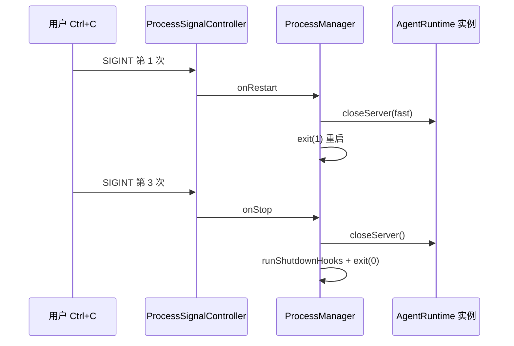
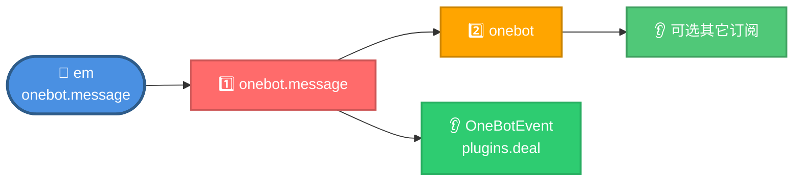
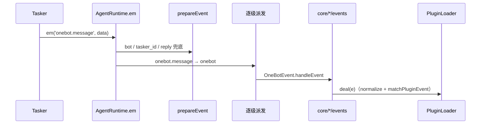
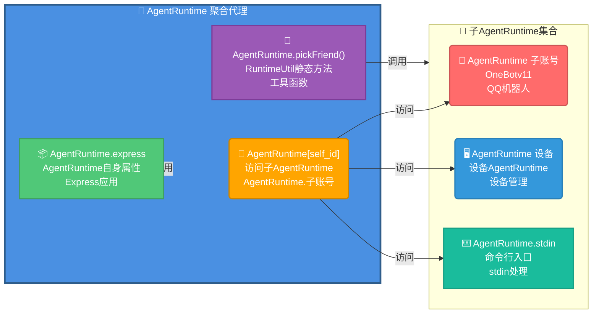
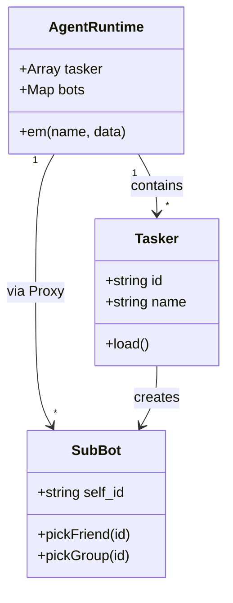
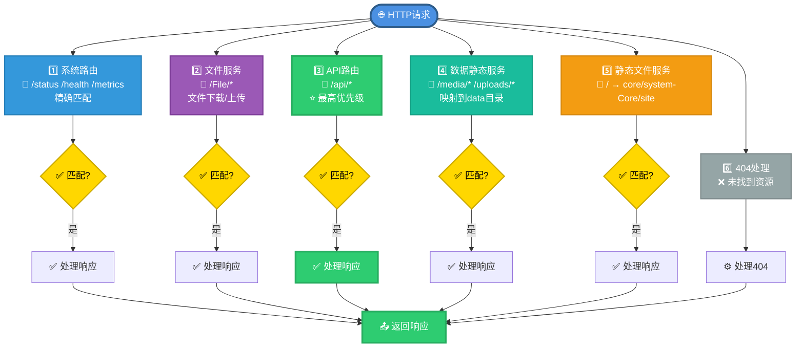
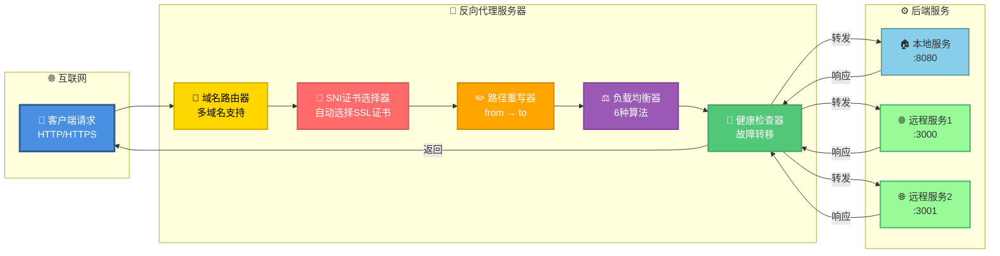

# AgentRuntime 主类文档

> **源码**：`src/agent-runtime.js`（类 `AgentRuntime`，构造后 `_createProxy()` 返回 Proxy）  
> **拆出实现**：`src/infrastructure/http/runtime-auth.js` · `runtime-listen.js` · `runtime-ws.js` · `runtime-proxy.js` · `runtime-middleware.js` · `runtime-static.js` · `runtime-observability.js` · `runtime-chaos.js` · `runtime-boot.js` · `runtime-net.js`（类方法薄包装委托；`run()` 启动 DAG 在 `runtime-boot`；本机 IP/对外 URL 在 `runtime-net`）  
> **启动**：默认 fail-fast（Loader/CommonConfig 失败拒绝 listen）；排障可设 `XRK_SOFT_FAIL_STARTUP=1`  
> **读者**：需理解 HTTP/WS、生命周期、关闭流程的开发者  
> **挂载面速查**：[runtime-surface.md](runtime-surface.md)（全局、`AgentRuntime.em`、`req.agentRuntime`、HTTP 业务层挂载）

---

## 📚 目录

- [快速开始](#快速开始)
- [核心职责](#核心职责)
- [生命周期](#生命周期)
- [核心 API](#核心-api)
- [事件系统](#事件系统)
- [多 AgentRuntime 管理](#多-agentruntime-管理)
- [HTTP 服务](#http-服务)
- [WebSocket 服务](#websocket-服务)
- [反向代理](#反向代理)
- [实用工具方法](#实用工具方法)
- [最佳实践](#最佳实践)
- [常见问题](#常见问题)

---

## 快速开始

### 推荐用法：通过启动脚本与全局 `AgentRuntime`

启动链见 **[startup.md](startup.md)**。一般**不需要**手动 `import AgentRuntime` 或 `new AgentRuntime()`：

- 启动：`node app`（推荐）或 `node app server {端口}`
- 运行时：
  - 在插件 / Tasker / 事件监听器等代码中，直接使用全局 `AgentRuntime`（由启动脚本挂载）
  - 在 HTTP API 中使用 `req.agentRuntime`（由 `HttpApi` 基类自动注入）

插件、Tasker 等业务代码中直接使用全局对象：

```javascript
// 在插件或 Tasker 中（全局 AgentRuntime 由启动脚本挂载，无需手动 import）
const subBot = AgentRuntime['123456'];           // 访问子 AgentRuntime
await subBot.sendMasterMsg('Hello');    // 发送消息给主人
```

### 在 HTTP API 中使用

```javascript
// core/my-core/http/myapi.js
export default {
  name: 'my-api',
  routes: [
    {
      method: 'GET',
      path: '/api/test',
      handler: async (req, res) => {
        const bot = req.agentRuntime;
        const url = bot.getServerUrl();
        const result = await bot.callRoute('/api/status');
        res.json({ success: true, url, status: result });
      }
    }
  ]
};
```

---

## 核心职责

`AgentRuntime` 类是 XRK-AGT 的核心运行时对象，统一管理以下功能：

| 职责模块 | 说明 |
|---------|------|
| **服务入口** | Express 应用、HTTP/HTTPS 服务器、静态文件服务、基础中间件 |
| **API 与 WebSocket** | 动态加载所有 `core/*/http` 目录下的 API 模块，管理 WebSocket 连接与路径路由 |
| **Tasker 与多 AgentRuntime** | 管理 Tasker 实例，按账号/设备 ID 管理子 AgentRuntime |
| **认证与安全** | API Key 生成/验证、127 回环免鉴权、WebSocket 统一鉴权 |
| **事件系统** | 统一事件入口 `AgentRuntime.em()`，事件准备与增强，逐级事件派发 |
| **HTTP业务层** | 重定向管理、CDN 支持、反向代理增强（负载均衡、健康检查） |
| **资源管理** | 临时文件清理、优雅关闭、Redis 持久化 |

---

## 生命周期


启动链分步说明见 [startup.md](startup.md)；挂载时间表见 [runtime-surface.md](runtime-surface.md)。

### 关闭流程与 Ctrl+C

信号由 `src/utils/process-signals.js` 的 `ProcessSignalController` 统一处理（`src/infrastructure/config/loader.js` → `ProcessManager.setupSignalHandlers()`）。**业务代码不要自行 `process.on('SIGINT')`**，否则会与三击语义冲突。

**服务端进程（`mode: 'server'`）**：

| 连按次数（3s 窗口内） | 行为 |
|---------------------|------|
| 第 1 次 | 重启（`closeServer({ fast: true })` → `exit(1)`，由菜单/PM2 拉起） |
| 第 2 次 | 提示再按 N 次将返回菜单 |
| 第 3 次 | 优雅关闭并 `exit(0)` 返回启动菜单 |
| 关闭进行中再按 | 强制 `exit(130)` |

**启动菜单（`mode: 'menu'`，`start.js`）**：连按 3 次退出程序；`spawnSync` 跑子进程期间 `pause()`，结束后 `resetStrikes()`。

自定义资源清理请用 `registerShutdownHook()`（渲染器浏览器实例已注册）。



---

## 核心 API

### 事件系统

#### `em(name, data, asJson, options)`

触发事件，支持**按点号逐级向上**派发（`_cascadeEmit`）。入站业务事件须带 **tasker 短名前缀**，并与 `core/*/events/` 订阅一致。

```javascript
// ✅ 基本用法：{tasker}.{post_type}
bot.em('onebot.message', {
  tasker: 'onebot',
  post_type: 'message',
  self_id: '123456',
  user_id: '789012',
  group_id: '345678',
  message: [{ type: 'text', text: 'Hello' }]
});

// stdin / HTTP 调试：走 stdin.message（与 StdinEvent、callStdin 一致）
const result = await bot.callStdin('help', { user_info: { tasker: 'api' }, timeout: 5000 });
```

> 插件侧匹配（`event: 'message'` / `onebot.message`）由 `#utils/event-keys.js` → `matchPluginEvent` 完成，**不是**靠 `em('message.group')` 这种无前缀名进 Listener。详见 [事件系统标准化文档](事件系统标准化文档.md)。

#### `prepareEvent(data)`

准备事件对象，自动添加通用属性：`bot`、`tasker_id`、`tasker_name`（来自 `bot.tasker` 元信息）、`sender`、`reply()` 等。事件身份短名用字符串字段 **`e.tasker`**（勿把 Tasker 实例挂到事件上）。
### 服务器管理

#### `run(options)` / `closeServer()` / `getServerUrl()` / `getLocalIpAddress()`

```javascript
await bot.run({ port: 端口号 });  // 端口号由开发者指定
await bot.closeServer();
const url = bot.getServerUrl();
// public：按 server.misc.detectPublicIP 探测；local 恒为 []（展示基址见 server.server.url → 公网 → 127.0.0.1）
const ipInfo = await bot.getLocalIpAddress();
```

### 路由调用

#### `callRoute(routePath, options)`

内部调用已注册的 HTTP 路由，无需发起 HTTP 请求。

```javascript
const result = await bot.callRoute('/api/status', {
  method: 'GET',
  query: { format: 'json' },
  timeout: 5000
});
```

#### `getRouteList(options)`

获取已注册的路由列表（支持扁平/分组）。

### stdin 命令

#### `callStdin(command, options)`

通过 stdin 执行命令。

---

## 事件系统

### 事件逐级派发机制

`em` 对**事件总线名**按点号从右剥离父级依次 `emit`（与插件 `event` 过滤是两套机制）：



**示例**（Core `events/`）：

```javascript
// system-Core/events/onebot.js：订阅读 onebot.message|notice|request
bot.on('onebot.message', (e) => {
  // markTasker → PluginLoader.deal(e)
});

bot.on('device.message', (e) => { /* 设备 Web / Event 模式 */ });
bot.on('stdin.message', (e) => { /* 终端 /api/stdin */ });
```

插件订阅示例（跨 Tasker vs 定 Tasker）：

```javascript
// 跨通道：所有 tasker 的 message
event: 'message'

// 仅 OneBot（不会命中 device/stdin）
event: 'onebot.message'
```

### 事件处理流程



### 事件对象结构

```javascript
{
  // 身份（触发方必填字符串短名）
  tasker: 'onebot',         // ≠ bot.tasker 实例；≠ tasker_id
  post_type: 'message',
  message_type: 'group',

  // prepareEvent 补充
  bot: SubBot,
  tasker_id: 'QQ',          // 来自 bot.tasker.id（元信息）
  tasker_name: 'OneBotv11',
  sender: { user_id: '...' },

  self_id: '123456',
  user_id: '789012',
  group_id: '345678',
  message: [{ type: 'text', text: 'Hello' }],

  reply: async (msg, quote, extraData) => {...},

  // Enhancer 挂载：isOneBot / friend / group / member 等
}
```

---

## 多 AgentRuntime 管理

### AgentRuntime 聚合代理架构

AgentRuntime 通过 `_createProxy()` 暴露为**多 AgentRuntime 聚合代理**，统一访问子 AgentRuntime、RuntimeUtil 静态方法和 AgentRuntime 自身属性：



**使用示例**：

```javascript
// 访问子AgentRuntime（IM账号）
const subBot = AgentRuntime['123456'];
await subBot.pickFriend('789012').sendMsg('Hello');

// 访问设备AgentRuntime
const deviceBot = AgentRuntime['device_001'];
await deviceBot.sendCommand('reboot');

// 访问 RuntimeUtil 静态方法（通过 AgentRuntime 代理透传）
const url = await AgentRuntime.fileToUrl('/path/to/file.jpg');
AgentRuntime.makeLog('info', '文件 URL 已生成', false);

// 访问AgentRuntime自身
AgentRuntime.express.get('/custom', (req, res) => {
  res.json({ message: 'Custom route' });
});
```

### Tasker 与子 AgentRuntime 关系



**特殊子 AgentRuntime**：
- `AgentRuntime.stdin`：命令行与 HTTP 统一入口
- `AgentRuntime[device_id]`：设备控制 AgentRuntime

---

## HTTP 服务

### 请求处理流程


### 路由优先级



### 认证机制

当前版本中，AgentRuntime 的认证职责划分如下（详见 `docs/AUTH.md`）：

- **Server 层 (`src/agent-runtime.js`)**  
  - 只做静态资源放行（根据扩展名）；  
  - 不在此层对全部 `/api/*` 统一拦截；密钥比对逻辑见 `checkApiAuthorization`；  
  - `127.*`（含 `::ffff:127.*`）来源免鉴权；可选 `server.auth.whitelist`。
- **HttpApi 路由 (`src/infrastructure/http/http.js`)**  
  - 路径以 `/api/` 开头时，由 `wrapHandler` 自动调用 `ensureSystemCoreAuth`（`src/infrastructure/http/auth.js`）；业务 handler 无需重复鉴权。  
- **其他 Core HTTP / Tasker**  
  - 可选择接入系统 API Key，或定义自己的鉴权方案（如自有 token / 签名）；  
  - Tasker 暴露的 WebSocket 路径统一经过 `wsConnect` 做系统级 API Key 校验（`127.*` 来源除外）。

**配置示例**：

```yaml
# config/default_config/server.yaml
auth:
  apiKey:
    enabled: true
    file: "config/server_config/api_key.json"
```

---

## WebSocket 服务

### WebSocket 连接流程

```mermaid
sequenceDiagram
    participant Client as 💻 WebSocket客户端
    participant AgentRuntime as 🤖 AgentRuntime.wsConnect
    participant Auth as 🔐 认证检查
    participant Handler as ⚙️ 路径处理器
    
    Note over Client,Handler: 🔌 WebSocket连接建立流程
    
    Client->>AgentRuntime: 📨 HTTP Upgrade请求<br/>GET /ws HTTP/1.1<br/>Upgrade: websocket<br/>Connection: Upgrade
    AgentRuntime->>Auth: 🔍 检查认证<br/>同HTTP认证机制<br/>API Key验证
    Auth->>AgentRuntime: ✅ 认证通过<br/>允许连接
    AgentRuntime->>AgentRuntime: 🔎 查找路径处理器<br/>AgentRuntime.wsf['/ws']<br/>匹配处理器
    AgentRuntime->>Handler: ⚙️ 调用处理器<br/>注册的WebSocket处理函数
    Handler->>Client: 🔌 WebSocket连接建立<br/>101 Switching Protocols
    
    Note over Client,Handler: 🔄 双向通信开始
    
    Client<->Handler: 💬 双向通信<br/>实时消息交换<br/>心跳保持连接
```

### 注册 WebSocket 处理器

```javascript
// core/my-core/tasker/MyTasker.js
export default class MyTasker {
  id = 'mytasker';
  path = 'mytasker';
  
  load() {
    AgentRuntime.wsf[this.path].push((ws, req) => {
      ws.on('message', (data) => {
        const message = JSON.parse(data);
        AgentRuntime.em('mytasker.message', {
          event_id: `mytasker_${Date.now()}`,
          message: message
        });
      });
    });
  }
}

// 客户端连接: ws://localhost:{端口}/mytasker  // 端口由启动配置决定
```

### WebSocket 心跳

AgentRuntime 自动管理 WebSocket 心跳检测：
- 默认超时：60秒（可通过 `server.yaml` 的 `websocket.heartbeatTimeout` 配置）
- 自动清理：断开超时连接
- 统计信息：`getWebSocketStats()`

---

## 反向代理

### 反向代理架构



### 反向代理特性

- **多域名支持**：一个服务器支持多个域名
- **SNI 支持**：每个域名独立的 SSL 证书
- **路径重写**：灵活的路径重写规则
- **HTTP/2 支持**：提升 HTTPS 性能
- **负载均衡**：轮询/加权/最少连接（HTTP业务层）
- **健康检查**：自动故障检测和转移（HTTP业务层）

### 配置示例

```yaml
# config/default_config/server.yaml
proxy:
  enabled: true
  httpPort: 80
  httpsPort: 443
  healthCheck:
    enabled: true
    interval: 30000
    maxFailures: 3
  domains:
    - domain: "api.example.com"
      ssl:
        enabled: true
        certificate:
          key: "/path/to/api.example.com.key"
          cert: "/path/to/api.example.com.cert"
      target:
        - url: "http://backend1:3000"
          weight: 3
        - url: "http://backend2:3000"
          weight: 1
      loadBalance: "weighted"
      rewritePath:
        from: "/api"
        to: "/"
```

详细文档：参见 [Server文档](server.md) 和 [HTTP业务层文档](http-business-layer.md)

---

## 实用工具方法

### 消息发送

```javascript
// 发送消息给主人（按配置的 masterQQ 逐个发送）
await bot.sendMasterMsg('服务器已启动', 5000);

// 发送好友消息（指定机器人）
await bot.sendFriendMsg('3652962217', '123456789', '你好，这是测试消息');

// 发送群消息（指定机器人）
await bot.sendGroupMsg('3652962217', '1075364017', '群里好');

// 不指定 botId 时，会自动选用一个已连接的机器人
await bot.sendGroupMsg(null, '1075364017', '用默认机器人发送');
```

### 合并转发

```javascript
// 创建合并转发消息
const forwardMsg = bot.makeForwardMsg({
  user_id: '123456',
  nickname: '用户',
  message: 'Hello'
});

// 创建合并转发数组
const forwardArray = bot.makeForwardArray([
  { message: '消息1' },
  { message: '消息2' }
], { user_id: '123456' });
```

### 文件处理

```javascript
// 将文件转换为URL
const url = await bot.fileToUrl('/path/to/file.jpg');
// 返回: "http://localhost:8080/File/..."  // 端口根据实际配置而定
```

### 错误处理

```javascript
// 创建标准化错误对象（自动记录日志）
const error = bot.makeError('操作失败', 'OperationError', {
  code: 'E001',
  context: 'user_action'
});
```

---

## 最佳实践

### 1. 事件处理

```javascript
// ✅ Tasker / events：带短名前缀
bot.on('onebot.message', (e) => { /* ListenerBase → deal */ });

// ✅ 插件：跨 Tasker 用通用 post；定通道加前缀
// event: 'message'           — 全通道
// event: 'onebot.message'    — 仅 OneBot（不进 device Event 模式）

// ❌ 勿对业务入站裸 em('message') / em('message.group')（无对应 events 监听则插件链不跑）
```

### 2. HTTP API 开发

```javascript
// ✅ 推荐：通过 req.agentRuntime 访问
export default {
  routes: [{
    handler: async (req, res) => {
      const bot = req.agentRuntime;
      const url = bot.getServerUrl();
      res.json({ url });
    }
  }]
};

// ❌ 不推荐：直接 import AgentRuntime（业务代码应使用全局 AgentRuntime，避免循环依赖）
import AgentRuntime from './src/agent-runtime.js';
```

### 3. 子 AgentRuntime 访问

```javascript
// ✅ 推荐：使用 Proxy 访问
const subBot = AgentRuntime['123456'];
if (subBot) {
  await subBot.pickFriend('789012').sendMsg('Hello');
}

// ❌ 不推荐：直接访问 bots 对象
const subBot = AgentRuntime.bots['123456'];  // 绕过 Proxy，可能缺少功能
```

### 4. 错误处理

```javascript
// ✅ 推荐：使用 makeError
try {
  // 操作
} catch (err) {
  const error = bot.makeError(err, 'OperationError', {
    context: 'my_operation'
  });
  // 错误已自动记录日志
}

// ❌ 不推荐：直接 throw
throw new Error('操作失败');  // 不会记录日志
```

### 5. 资源清理

```javascript
// ✅ 推荐：注册 shutdown hook（与框架三击关闭协同）
import { registerShutdownHook } from '#utils/process-signals.js';

registerShutdownHook(async () => {
  await myResource.close();
});

// ❌ 不推荐：自行监听 SIGINT（与 ProcessSignalController 冲突）
process.on('SIGINT', async () => {
  await bot.closeServer();
  process.exit(0);
});
```

---

## 常见问题

### Q: 如何修改默认端口？

A: 在 `config/default_config/server.yaml` 中配置，或通过 `run({ port: 8080 })` 传入。

### Q: 如何添加自定义中间件？

A: 在 `_initializeMiddlewareAndRoutes()` 方法中添加，或通过插件系统扩展。

### Q: WebSocket 连接失败怎么办？

A: 检查：
1. WebSocket 路径是否正确注册（`AgentRuntime.wsf[path]`）
2. 认证是否通过（同 HTTP 认证）
3. 防火墙是否开放端口

### Q: 如何实现负载均衡？

A: 使用反向代理配置，支持轮询/加权/最少连接算法。详见 [HTTP业务层文档](http-business-layer.md#反向代理增强)。

### Q: 事件监听器没有触发？

A: 检查：
1. 事件名是否正确（支持逐级派发）
2. 事件数据是否包含必要字段（`self_id`、`user_id` 等）
3. 监听器是否在 `ListenerLoader.load()` 之后注册

### Q: 如何获取所有已注册的路由？

A: 使用 `bot.getRouteList()`。

### Q: 如何内部调用 API 而不发起 HTTP 请求？

A: 使用 `bot.callRoute('/api/endpoint', options)`。

### Q: 如何清理临时文件？

A: AgentRuntime 自动清理 `trash/` 目录，可通过配置调整：

```yaml
server:
  misc:
    trashCleanupIntervalMinutes: 60  # 清理间隔（分钟）
    trashMaxAgeHours: 24              # 保留时间（小时）
```

---

## 相关文档

- **[Server 服务器架构](server.md)** - HTTP/HTTPS/WebSocket 服务详细说明
- **[HTTP业务层](http-business-layer.md)** - 重定向、CDN、反向代理增强
- **[system-Core 特性](system-core.md)** - system-Core 内置模块完整说明，包含所有HTTP API、工作流、插件和Web控制台 ⭐
- **[项目概览](../PROJECT_OVERVIEW.md)** - 项目整体架构
- **[插件系统](plugin-base.md)** - 插件开发指南
- **[AiWorkflow 文档](ai-workflow.md)** - Node 侧单次对话 + MCP 工具调用（复杂多步在 Python 子服务端）

---

*最后更新：2026-06-14*
