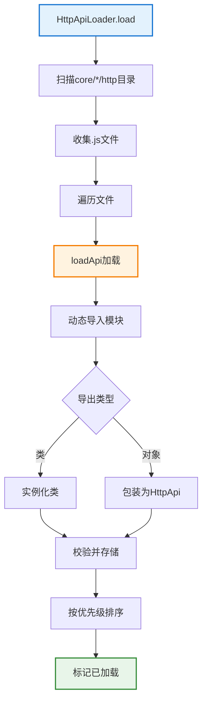
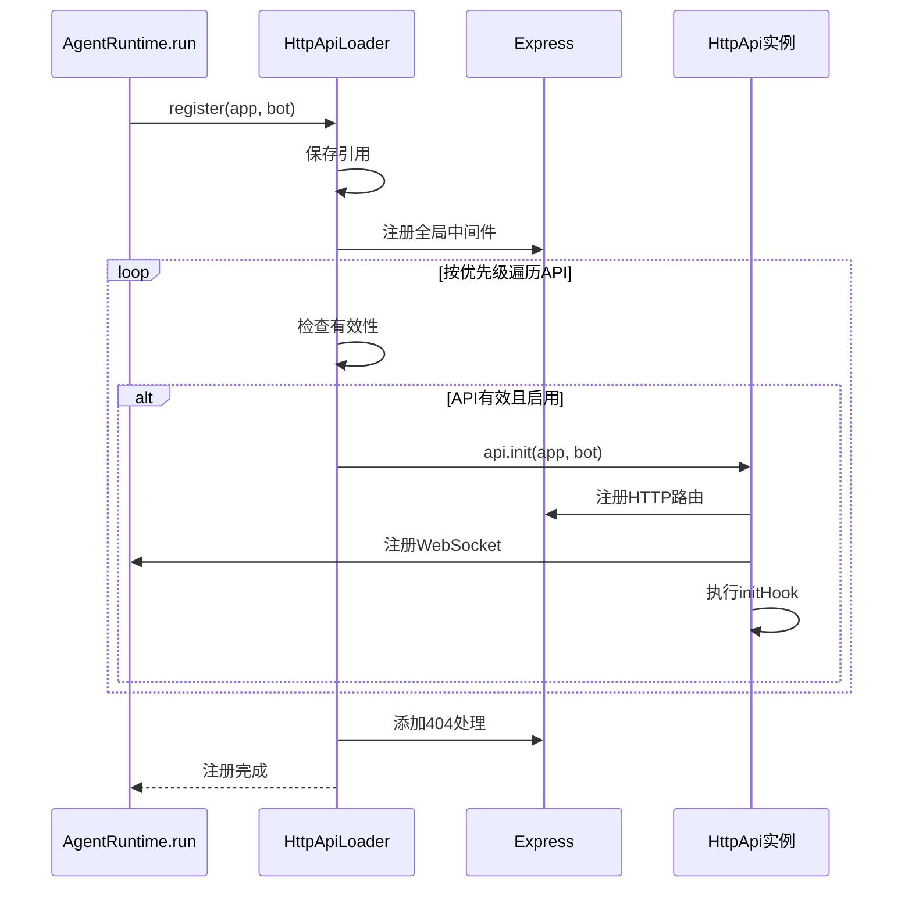
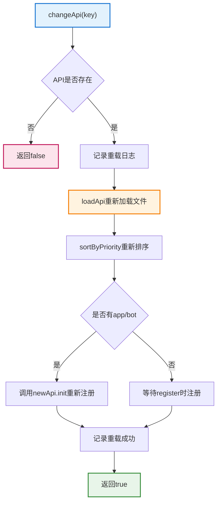
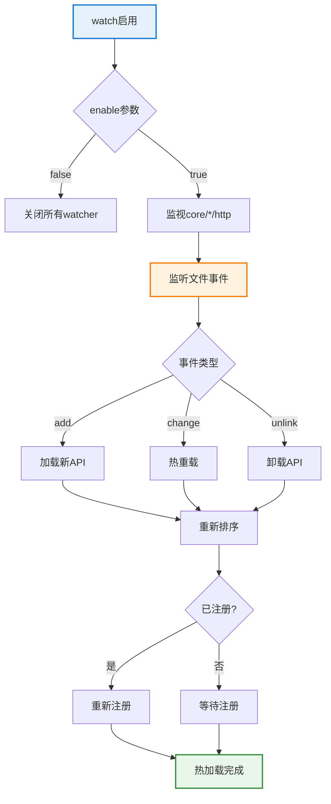

# API 加载器文档

> **文件位置**：`src/infrastructure/http/loader.js`  
> **Loader 模式**：[infrastructure-shared.md](infrastructure-shared.md) · **基类**：[http-api.md](http-api.md) / [base-classes.md](base-classes.md)  
> **可扩展性**：[框架可扩展性指南](框架可扩展性指南.md)

`HttpApiLoader` 负责从所有 `core/*/http` 目录动态加载所有 HTTP API 模块，并完成：

- API 实例化与优先级排序
- 将路由与 WebSocket 处理器注册到 Express 与 AgentRuntime
- 监控 API 文件变更，实现热加载


## 📚 目录

- [扩展特性](#扩展特性)
- [核心属性](#核心属性)
- [加载流程](#加载流程)
- [注册流程](#注册流程)
- [单个 API 重载](#单个-api-重载)
- [文件监视与热加载](#文件监视与热加载)
- [API 信息获取](#api-信息获取)
- [使用建议](#使用建议)
- [相关文档](#相关文档)

---

## 扩展特性

- ✅ **自动发现**：自动扫描所有 `core/*/http/` 目录（支持递归）
- ✅ **灵活导出**：支持类导出和对象导出两种方式
- ✅ **热重载**：支持文件监听和自动重载
- ✅ **错误隔离**：单个API加载失败不影响其他API
- ✅ **优先级排序**：支持按优先级排序

> 💡 **实际示例**：system-Core 提供了 **11 个** HTTP API 模块的实际实现，展示了如何使用 HttpApiLoader 自动加载和管理 API。详见 [system-Core 特性文档](system-core.md#http-api-模块)。

---

## 核心属性

- `apis: Map<string, apiInstance>`：以 **`resolveQualifiedCoreModuleKey`** 生成的 key 存储实例——形如 `system-Core/ai-workspace`（`Core名/相对 http/ 路径`，不含 `.js`）。**不含** `http/` 前缀。
- `priority: apiInstance[]`：按优先级排序后的 API 列表。
- `_hotReload: HotReloadBase | null`：统一文件监视（见 [infrastructure-shared.md](infrastructure-shared.md)）。
- `loaded: boolean`：是否已经完成初次加载。
- `app`：当前 Express 实例。
- `bot`：当前 AgentRuntime 实例。

---

## 加载流程：`load()`

**API加载完整流程**:



**步骤说明**：

1. 调用 `paths.getCoreSubDirs('http')` 获取所有 `core/*/http` 目录
2. 调用 `getApiFiles` 递归扫描每个目录，收集 `.js` 文件
3. 对每个文件调用 `loadApi`：
   - 生成 key（`resolveCoreModuleKey`，相对 `core/*/http/`，无 `.js`）
   - 动态导入模块并实例化
   - 校验并存入 `apis` Map
4. 调用 `sortByPriority` 排序
5. 标记 `loaded = true`

---

## 注册流程：`register(app, bot)`

**API注册完整流程**:



**步骤说明**：

1. **保存引用**：保存 `app` 与 `bot` 引用到 `this.app` 和 `this.bot`
2. **注册全局中间件**：注入 `req.agentRuntime = bot` 和 `req.apiLoader = this`
3. **按优先级初始化**：遍历 `this.priority`（已按优先级降序排序）
   - 检查API有效性（是否为对象）
   - 检查启用状态（`api.enable !== false`）
   - 调用 `api.init(app, bot)` 初始化
   - 记录注册日志（包含路由数和WS数）
4. **404兜底处理**：添加 `/api/*` 404处理，排除代理路由（如 `/api/god/*`）

**优先级说明**：
- 优先级数字越大，优先级越高
- 按优先级降序排序（高优先级在前）
- 相同优先级按加载顺序

> **重要**：所有 API 路由都会经过 AgentRuntime 的认证中间件与通用中间件栈，确保有统一的安全与日志策略。API 不需要自己实现认证逻辑。

---

## 单个 API 重载：`changeApi(key)`

**API重载流程**:



**步骤说明**：

1. **查找API**：通过 key 找到旧 API 实例
2. **重新加载**：调用 `loadApi(api.filePath)` 重新加载模块
3. **重新排序**：调用 `sortByPriority()` 调整优先级顺序
4. **重新注册**：若新 API 存在且已经有 `app` 和 `bot`：
   - 调用 `newApi.init(this.app, this.bot)` 重新注册路由和WebSocket
5. **记录日志**：输出重载完成日志

**使用场景**：
- 文件变化触发（热重载）
- 手动重载单个 API（调试时）

**注意事项**：
- 旧路由不会自动卸载，通常需要配合 `AgentRuntime` 重启或明确设计幂等初始化逻辑
- 重载时确保 `init` 方法是幂等的（多次调用不会产生副作用）
- 全局中间件需要确保不会重复挂载

---

## 文件监视与热加载：`watch(enable = true)`

**热加载流程**:



**事件处理**：

- **`add`** - 新增文件时：
  - 调用 `loadApi` 加载新API
  - 调用 `sortByPriority` 重新排序
  - 若已初始化（有 `app` 和 `bot`），调用 `init` 即时挂载
  
- **`change`** - 文件修改时：
  - `HotReloadBase` 内容 hash 未变则跳过
  - 调用 `changeApi(key)`（实例内 `filePath` 或 `_findApiFile`）
  - 自动重新注册路由和 WebSocket
  
- **`unlink`** - 文件删除时：
  - 延迟确认后调用 `unloadApi`
  - 调用 `sortByPriority` 重新排序

**注意事项**：
- 热重载语义（hash / unlink 延迟）见 [infrastructure-shared.md](infrastructure-shared.md)
- 热重载时确保 `init` 方法是幂等的
- 全局中间件需要确保不会重复挂载
- 复杂API建议重启进程以获得更清晰的状态

---

## API 信息获取：`getApiList()` 与 `getApi(key)`

### `getApiList()`

遍历 `this.apis`，对每个实例调用 `getInfo()`（若存在），否则构造基本信息。

**返回格式**：
```javascript
[
  {
    name: 'example-api',
    dsc: '示例 API',
    priority: 100,
    routes: 2,
    ws: 1,
    enable: true,
    createTime: 1703123456789
  },
  // ...
]
```

**使用场景**：
- 后台管理面板展示
- 对外提供 API 文档与统计
- 前端动态生成API列表

### `getApi(key)`

按 key 返回对应API实例，不存在则返回 `null`。

**参数**：
- `key`: API 键名（`resolveQualifiedCoreModuleKey` 结果，如 `system-Core/ai-workspace` 或嵌套 `system-Core/example/ping`；勿加 `http/` 前缀）

**返回值**：`HttpApi` 实例或 `null`

**使用示例**：
```javascript
const api = HttpApiLoader.getApi('example/ping');
if (api) {
  const info = api.getInfo();
  console.log('API信息:', info);
}
```

---

## 使用建议

### 新增 API 模块

1. **创建文件**：在任意 `core/*/http` 目录下创建新的 `.js` 文件（如 `core/my-core/http/my-api.js`）
2. **导出配置**：按 [HTTP API 基类文档](http-api.md) 中的推荐方式导出 `default`
3. **自动加载**：`HttpApiLoader` 会在启动或文件变更时自动加载  
4. **开发约定**：鉴权、响应格式、错误处理、参数校验等请遵循 [http-api.md - HTTP 业务层开发建议](http-api.md#http-业务层开发建议)

**示例**：
```javascript
// core/my-core/http/my-api.js
export default {
  name: 'my-api',
  dsc: '我的API',
  routes: [/* ... */]
};
```

### 调试路由问题

1. **检查加载状态**：
   - 确认 API 是否出现在 `getApiList()` 输出中
   - 查看启动日志中对应 API 的加载信息

2. **检查注册状态**：
   - 查看启动日志中对应 API 的「注册路由」信息
   - 检查是否被 `enable === false` 禁用

3. **检查路由配置**：
   - 验证 `method`、`path`、`handler` 是否完整
   - 检查路径是否正确（注意大小写）

4. **检查中间件**：
   - 确认是否被AgentRuntime中间件拦截
   - 检查认证是否通过

### 热更新注意事项

1. **幂等性**：
   - 若 API 内部在 `init` 中注册了全局中间件，应确保多次调用不会产生重复挂载
   - 可以使用 idempotent 逻辑（检查是否已注册）

2. **状态管理**：
   - 对于复杂 API（如数据库连接、长连接），必要时仍建议重启进程
   - 确保重载时正确清理资源

3. **错误处理**：
   - 热重载失败不会影响其他API
   - 查看日志了解重载失败原因

### 与工作流系统集成

API可以通过 `AiWorkflowLoader` 调用工作流系统：

```javascript
import AiWorkflowLoader from '#infrastructure/ai-workflow/loader.js';

export default {
  name: 'ai-api',
  routes: [
    {
      method: 'POST',
      path: '/api/ai/chat', // 自定义 Core 示例路径；内置网关见 ai.js（/v1/chat/completions 等）
      handler: async (req, res, bot) => {
        const stream = AiWorkflowLoader.getWorkflow('chat');
        if (!stream) {
          return res.status(404).json({ success: false, message: '工作流未找到' });
        }
        
        const e = {
          user_id: req.user?.id || 'web_user',
          msg: req.body.message,
          reply: async (msg) => {
            res.json({ success: true, response: msg });
          }
        };
        
        await stream.process(e, req.body.message, {
          enableMemory: true
        });
      }
    }
  ]
};
```

---

## 相关文档

- **[HTTP API 基类](http-api.md)** - HttpApi 基类完整说明
- **[system-Core 特性](system-core.md)** - system-Core 内置模块完整说明，包含 **11 个** HTTP API 模块的实际示例 ⭐
- **[框架可扩展性指南](框架可扩展性指南.md)** - 扩展开发完整指南

---

*最后更新：2026-06-14*