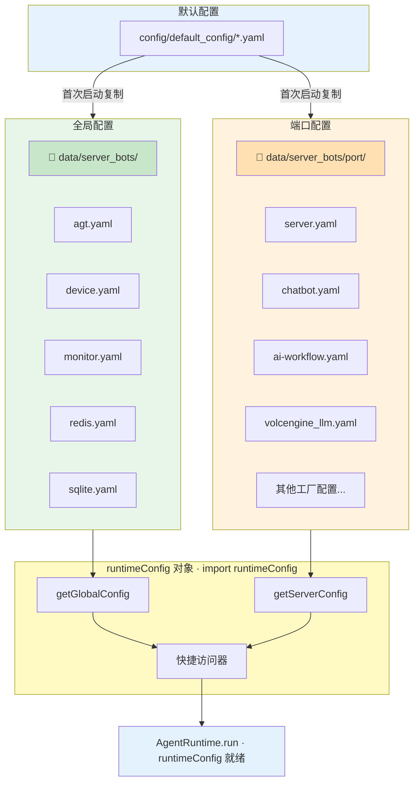
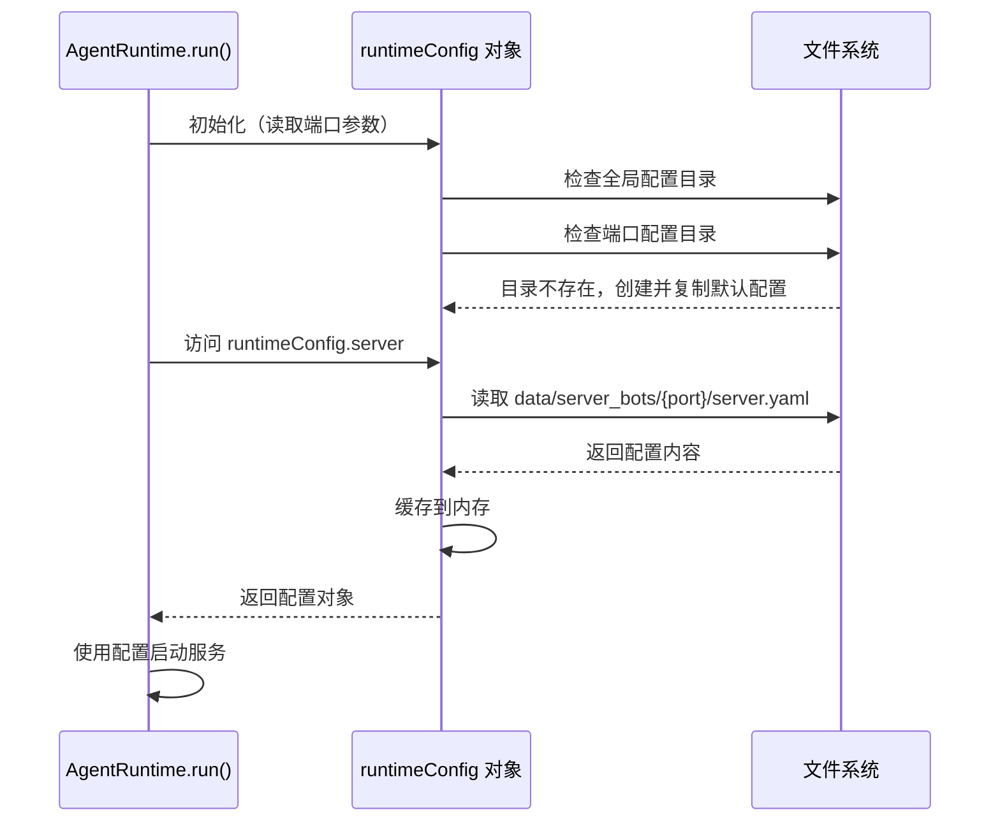
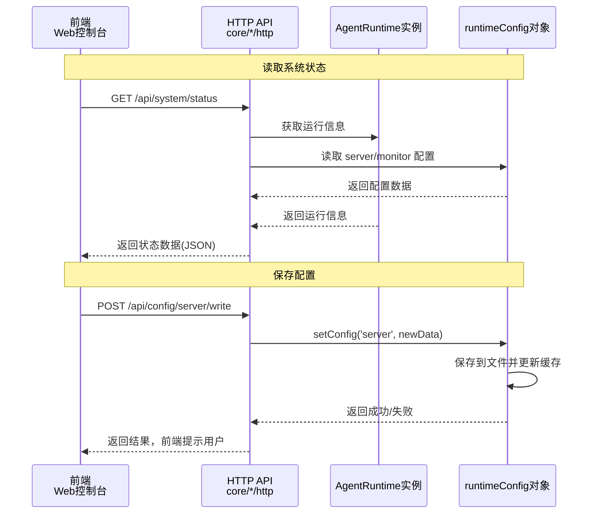
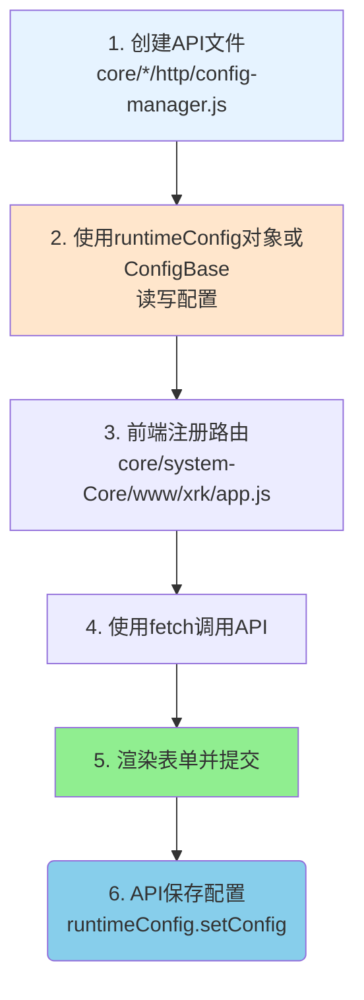
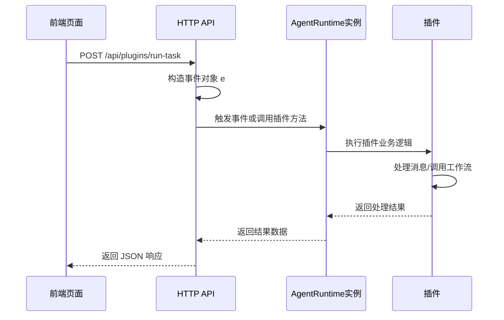
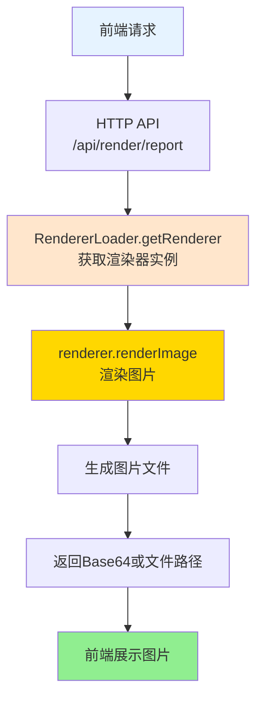
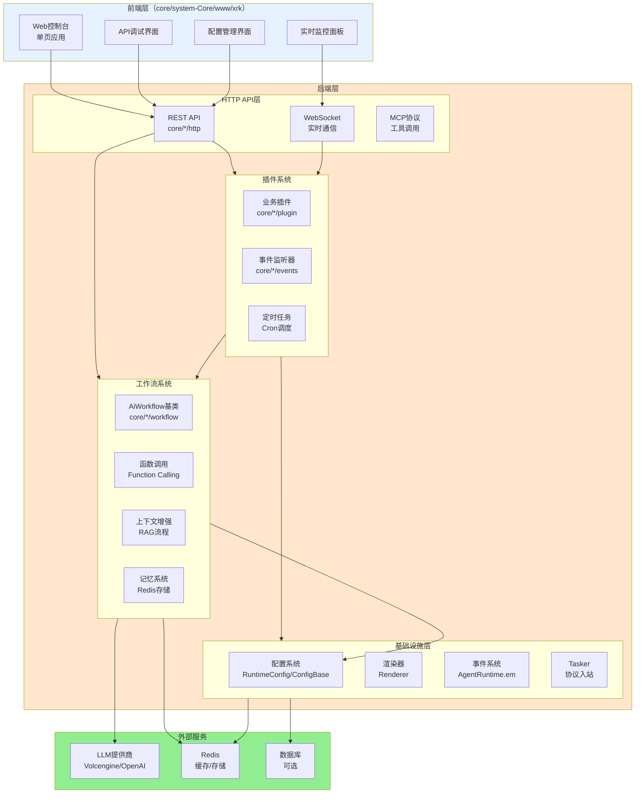
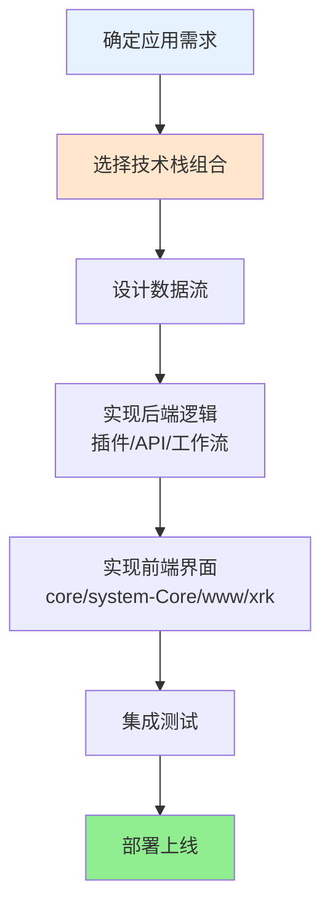

# 应用 & 前后端开发总览

> **文件位置**：`core/system-Core/www/xrk/`（Vue 3 + Vite + Naive UI，`sign.json` 挂 `dist/`）、`start.js` 菜单后的 AgentRuntime 运行时
> **启动链**（bootstrap、环境变量、Playwright）：见 **[startup.md](startup.md)** — 本文不重复引导细节。

本篇说明 Web 控制台、前后端协作、`runtimeConfig` 配置体系，以及插件 / 工作流 / HTTP API 的整合方式。

### 核心特性

- ✅ **Web 控制台**：系统状态、API 调试、配置管理（`/xrk/`）
- ✅ **技术栈整合**：插件 + 工作流 + HTTP API + 渲染器 + 配置 + 事件
- ✅ **前后端分离**：前端经 HTTP API 与 `AgentRuntime` 交互

---

## 📚 目录

- [配置系统（runtimeConfig 对象）](#配置系统runtimeConfig-对象)
- [Web 控制台与 API 交互](#web-控制台coresystem-corewwwxrk-与-api-交互)
- [典型开发场景](#典型开发场景)
- [建议的前后端协作模式](#建议的前后端协作模式)
- [完整技术栈整合方案](#完整技术栈整合方案)
- [进一步阅读](#进一步阅读)

---

## 配置系统（runtimeConfig 对象）

XRK-AGT 的配置系统采用**全局配置 + 端口配置**的分离设计，通过 `runtimeConfig` 对象统一管理。

### 配置架构




### 配置分类

#### 1. 全局配置（不随端口变化）

全局配置存储在 `data/server_bots/` 根目录，所有端口实例共享：


| 配置名称      | 文件路径                            | 说明           |
| --------- | ------------------------------- | ------------ |
| `agt`     | `data/server_bots/agt.yaml`     | AGT 主配置      |
| `device`  | `data/server_bots/device.yaml`  | 设备配置         |
| `monitor` | `data/server_bots/monitor.yaml` | 监控配置         |
| `redis`   | `data/server_bots/redis.yaml`   | Redis 连接配置（详见 [database.md](database.md)）   |
| `sqlite`  | `data/server_bots/sqlite.yaml`  | SQLite 配置    |


**使用方式**：

```javascript
// 通过快捷访问器
const agtConfig = runtimeConfig.agt;
const redisConfig = runtimeConfig.redis;

// 或通过方法
const deviceConfig = runtimeConfig.getGlobalConfig('device');
```

#### 2. 端口配置（随端口变化）

端口配置存储在 `data/server_bots/{port}/` 目录，每个端口实例独立：


| 配置名称             | 文件路径                                          | 说明                                                      |
| ---------------- | --------------------------------------------- | ------------------------------------------------------- |
| `server`         | `data/server_bots/{port}/server.yaml`         | 服务器配置（端口、代理等）                                           |
| `chatbot`        | `data/server_bots/{port}/chatbot.yaml`        | 机器人业务（主人/黑白名单/私聊 + 群默认与按群号覆盖）                         |
| `ai-workflow`       | `data/server_bots/{port}/ai-workflow.yaml`       | AI 工作流、工厂默认提供商（`llm`/`asr`/`tts`）等，见 `docs/ai-workflow.md` |
| `volcengine_llm` | `data/server_bots/{port}/volcengine_llm.yaml` | 火山引擎 LLM 配置                                             |
| `其他工厂配置`         | `data/server_bots/{port}/*.yaml`              | 其他 LLM/ASR/TTS 提供商配置                                    |


**使用方式**：

```javascript
// 通过快捷访问器
const serverConfig = runtimeConfig.server;
const chatbotConfig = runtimeConfig.chatbot;

// 或通过方法
const chatbotConfig = runtimeConfig.chatbot;
const groupDefaults = runtimeConfig.getGroup(); // 或 getGroup(群号)
```

### runtimeConfig 对象 API

#### 核心方法


| 方法                        | 说明           | 示例                                                         |
| ------------------------- | ------------ | ---------------------------------------------------------- |
| `getGlobalConfig(name)`   | 获取全局配置       | `runtimeConfig.getGlobalConfig('agt')`                               |
| `getServerConfig(name)`   | 获取端口配置       | `runtimeConfig.getServerConfig('server')`                            |
| `getConfig(name)`         | 自动判断全局/端口配置  | `runtimeConfig.getConfig('agt')` → 全局 `runtimeConfig.getConfig('server')` → 端口 |
| `setConfig(name, data)`   | 保存配置（自动判断类型） | `runtimeConfig.setConfig('server', {...})`                           |
| `getConfigDir()`          | 获取当前端口配置目录   | `data/server_bots/8080`                                    |
| `getGlobalConfigDir()`    | 获取全局配置目录     | `data/server_bots`                                         |
| `getRendererConfig(type)` | 获取渲染器配置      | `runtimeConfig.getRendererConfig('puppeteer')`                       |
| `watch(file, name, key)`  | 监听配置变更       | 自动调用，无需手动使用                                                |


#### 快捷访问器

**全局配置访问器**：

- `runtimeConfig.agt` - AGT 配置
- `runtimeConfig.device` - 设备配置
- `runtimeConfig.monitor` - 监控配置
- `runtimeConfig.redis` - Redis 配置
- `runtimeConfig.sqlite` - SQLite 配置

**端口配置访问器**：

- `runtimeConfig.aiWorkflow` - AI 工作流与工厂默认提供商等（`getServerConfig('ai-workflow')`，文件在端口目录）
- `runtimeConfig.server` - 服务器配置
- `runtimeConfig.chatbot` - 机器人业务（主人/黑白名单/私聊 + 群默认与按群号覆盖）
- `runtimeConfig.volcengine_llm` - 火山引擎 LLM 配置
- `runtimeConfig.renderer` - 渲染器配置（合并 puppeteer + playwright）

**便捷方法**：

- `runtimeConfig.masterQQ` - 获取主人 QQ 号列表
- `runtimeConfig.master` - 获取主人映射对象
- `runtimeConfig.getGroup(groupId)` - 从 chatbot 合并群生效配置（default ∪ 群号覆盖）
- `runtimeConfig.port` - 获取当前端口号（只读）

### 配置加载流程




### 配置使用示例

```javascript
// 在插件中使用配置
export default class MyPlugin extends PluginBase {
  constructor() {
    super({ name: '示例插件' });
  }
  
  async onMessage(e) {
    // 读取端口配置
    const serverConfig = runtimeConfig.server;
    const chatbotConfig = runtimeConfig.chatbot;
    
    // 读取全局配置
    const redisConfig = runtimeConfig.redis;
    const aiWorkflowConfig = runtimeConfig.aiWorkflow;
    
    // 读取群生效配置（chatbot.default ∪ 群号覆盖）
    const groupConfig = runtimeConfig.getGroup(e.group_id);
    
    // 使用配置
    if (groupConfig.enabled) {
      // 处理逻辑
    }
  }
}

// 在 HTTP API 中使用配置
export default {
  name: 'config-api',
  routes: [{
    method: 'GET',
    path: '/api/config/server',
    handler: async (req, res) => {
      // 读取配置
      const serverConfig = runtimeConfig.server;
      res.json({ success: true, data: serverConfig });
    }
  }, {
    method: 'POST',
    path: '/api/config/server',
    handler: async (req, res) => {
      // 保存配置
      const success = runtimeConfig.setConfig('server', req.body);
      res.json({ success, message: success ? '保存成功' : '保存失败' });
    }
  }]
};
```

### ConfigBase（高级配置管理）

`ConfigBase` 提供面向对象、可校验的配置操作 API，适用于需要 Schema 验证、自动备份等高级特性的场景：


| 能力    | 方法                                 | 说明                      |
| ----- | ---------------------------------- | ----------------------- |
| 文件访问  | `read()/write()/exists()/backup()` | 带缓存的 YAML/JSON 读写与自动备份  |
| 路径操作  | `get/set/delete/append/remove`     | 基于「点号 + 数组下标」的读写 API    |
| 合并与重置 | `merge()/reset()`                  | 深度合并、恢复默认配置             |
| 校验    | `validate(data)`                   | 按 `schema` 验证字段类型、范围、枚举 |
| 结构导出  | `getStructure()`                   | 供前端生成「动态表单」所需的字段元数据     |


**详细文档**：参见 [ConfigBase 文档](config-base.md)

---

## Web 控制台（core/system-Core/www/xrk）与 API 交互

Vue 3 SPA（`src/`），构建产物在 `dist/`（**预构建入库**）。维护者改控制台后**建议** `pnpm build` 并提交 `dist/`；也**支持**使用者自行 `cd core/system-Core/www/xrk && pnpm install && pnpm build`（或根目录 `pnpm run build:www`）。开发可用 `sign.json` 的 `enabled: true` 反代 Vite。详见 [www-mount.md](www-mount.md)「`/xrk` 控制台：`dist` 与自建」。

核心页面：`#/home` 概览 · `#/chat` 对话 · `#/config` 配置 · `#/api` 调试。鉴权头 `X-API-Key`；成功体用 `unwrapSuccess`（见 `src/utils/http.js`）。

**访问路径**：`/<目录名>`（如 `/xrk`，具体端口由启动配置决定）

### Core www 浏览器兼容

浏览器页走 **skill `xrk-www-compat`**（`web-compat.js` 或内联垫片）。校园 WebView 下用 `abortTimeout` / `randomId` 等兼容 API；`HttpResponse.success` 对象拍平，前端读顶层或 `unwrapSuccess`。

权威模块：`web-compat.js`（仅 `/xrk` 相对导入）。产品页**只内联**同语义。根名 `shared` 保留。挂载两类规则见 **[www-mount.md](www-mount.md)**、skill **`xrk-www-compat`**。

| 页面 | 实拍 |
|------|------|
| 系统概览 |  |
| AI 对话 |  |
| API 调试 |  |

`core/system-Core/www/xrk/index.html` + `core/system-Core/www/xrk/app.js` 实现了一个单页控制台，核心功能包括：

- 系统状态监控（通过 HTTP API 拉取指标）。
- API 调试页面（动态加载可用 API 列表）。
- 配置管理器（读写配置相关 API）。
- 与后台 WebSocket 建立连接，监听运行时事件。

**关键交互路径示意：**




前端开发者需要关注：

- 所有可调用的 API 列表，可以通过 `/api/...` 中某个「API 列表接口」获取（例如 `HttpApiLoader.getApiList()` 暴露的接口）。
- XRK-AGT 采用常规的 REST + JSON 交互模式，支持跨域配置与 API-Key 认证。

---

## 典型开发场景

### 1. 新增一个「配置管理」页面




**步骤**:

1. **后台 API**: 在任意 `core/*/http` 目录创建 API，使用 `ConfigBase` 子类读写配置
2. **前端页面**: 在 `core/system-Core/www/xrk/app.js` 注册路由，使用 `fetch` 调用 API

### 2. 在前端触发某个插件功能




**步骤**:

1. 创建 HTTP API，构造事件对象并调用插件
2. 前端提供按钮，点击后调用 API

### 3. 前端使用渲染器生成图片




**步骤**:

1. 创建渲染API，使用 `RendererLoader.getRenderer()` 生成图片
2. 前端调用API并展示返回的图片

---

## 建议的前后端协作模式

- **后端优先提供清晰的 API 文档**：基于 `HttpApi.getInfo()` 和 `HttpApiLoader.getApiList()` 生成接口列表，前端直接复用。
- **统一使用 JSON 结构**：所有接口尽量遵循 `{ success, data, message }` 结构，简化前端错误处理。
- **通过 ConfigBase 提供「结构化配置」**：前端不直接操作 YAML，而是通过字段定义自动生成表单。
- **渲染输出统一走 Renderer**：无论是截图、报表、预览，尽量经由 `Renderer` 管理模板与静态资源，保持一致的目录结构。

---

## 完整技术栈整合方案

XRK-AGT 提供了完整的技术栈，开发者可以灵活组合使用：

### 技术栈架构图




### 技术栈组合方案

#### 方案1：简单AI对话应用

**技术栈**：插件 + 工作流 + LLM

```javascript
// 1. 创建插件（core/my-core/plugin/chat.js）
export default class ChatPlugin extends PluginBase {
  constructor() {
    super({
      name: '聊天插件',
      event: 'message',
      rule: [{ reg: '.*', fnc: 'chat' }]
    });
  }
  
  async chat(e) {
    const stream = this.getWorkflow('chat');
    await stream.process(e, e.msg, {
      enableMemory: true  // 启用记忆系统
    });
  }
}

// 2. 工作流自动处理：
//    - 检索历史对话（Embedding相似度）
//    - 调用LLM生成回复
//    - 存储到记忆系统
//    - 自动发送回复
```

**应用场景**：智能客服、聊天机器人、问答系统

#### 方案2：复杂任务自动化应用

**技术栈**：插件 + 工作流 + MCP + MemoryManager

```javascript
// 1. 创建插件（core/my-core/plugin/assistant.js）
export default class AssistantPlugin extends PluginBase {
  constructor() {
    super({
      name: '智能助手',
      event: 'message',
      rule: [{ reg: '^#助手', fnc: 'assistant' }]
    });
  }
  
  async assistant(e) {
    // 简单任务：直接使用工作流
    const desktopStream = this.getWorkflow('desktop');
    await desktopStream.process(e, e.msg, {
      enableMemory: true,           // 整合记忆工具工作流
      enableDatabase: true,         // 整合知识库工具工作流
      enableTools: true            // 整合文件操作工具工作流
    });
    
    // 复杂任务：优先拆分为多个工作流 + MCP 工具协作
    // 如需 Python 能力：调用你自定义的子服务端扩展 API
  }
}

// 2. 工作流自动处理：
//    - 简单任务：直接执行
//    - 复杂任务：通过工作流 + MCP 工具编排，必要时调用自定义子服务端扩展 API
//    - 自动记录笔记，传递上下文
```

**应用场景**：智能办公助手、自动化脚本、复杂任务编排

> **注意**：Node 侧多步能力通过工作流 + MCP 工具协作实现；Python 子服务端用于承载可选扩展 API，而非固定 AI 编排入口。  
> **内置 AI 端点**（system-Core）：`POST /v1/chat/completions`、`GET /v1/models`、`POST /v1/messages`、`POST /v1/responses`；控制台目录 `GET /api/ai/models`。**无** `/api/ai/chat`，**已移除** `/api/v3/*` 与 `/api/ai/stream`。下列为**自定义 Core** 示例路径。

#### 方案3：Web控制台应用

**技术栈**：前端 + HTTP API + 工作流 + 渲染器

```javascript
// 1. 创建HTTP API（core/my-core/http/ai-chat.js）
import AiWorkflowLoader from '#infrastructure/ai-workflow/loader.js';

export default {
  name: 'ai-chat-api',
  dsc: 'AI聊天API',
  routes: [
    {
      method: 'POST',
      path: '/api/ai/chat',
      handler: async (req, res, bot) => {
        const { message, streamName = 'chat' } = req.body;
        const stream = AiWorkflowLoader.getWorkflow(streamName);
        
        if (!stream) {
          return res.status(404).json({
            success: false,
            message: '工作流未找到'
          });
        }
        
        // 构造事件对象
        const e = {
          user_id: req.user?.id || 'web_user',
          group_id: `web_${req.user?.id}`,
          msg: message,
          reply: async (msg) => {
            res.json({ success: true, response: msg });
          }
        };
        
        try {
          await stream.process(e, message, {
            enableMemory: true
          });
        } catch (error) {
          res.status(500).json({
            success: false,
            message: error.message
          });
        }
      }
    }
  ]
};

// 2. 前端调用（core/system-Core/www/xrk/app.js）
async function sendMessage(message) {
  const response = await fetch('/api/ai/chat', {
    method: 'POST',
    headers: { 'Content-Type': 'application/json' },
    body: JSON.stringify({ message })
  });
  const data = await response.json();
  displayMessage(data.response);
}
```

**应用场景**：Web聊天界面、管理后台、API服务

#### 方案4：数据可视化应用

**技术栈**：插件 + 工作流 + 渲染器 + HTTP API

```javascript
// 1. 创建插件（core/my-core/plugin/report.js）
export default class ReportPlugin extends PluginBase {
  constructor() {
    super({
      name: '报表生成',
      event: 'message',
      rule: [{ reg: '^#报表', fnc: 'generateReport' }]
    });
  }
  
  async generateReport(e) {
    // 调用工作流分析数据
    const stream = this.getWorkflow('desktop');
    await stream.process(e, '分析数据并生成报表', {
      enableMemory: true
    });
    
    // 使用渲染器生成图片
    import RendererLoader from '#infrastructure/renderer/loader.js';
    const renderer = RendererLoader.getRenderer(); // 默认 agt.browser.renderer（playwright）
    if (renderer) {
      const imagePath = await renderer.renderImage({
        template: 'report-template',
        data: { analysis }
      });
      await this.reply(imagePath);
    }
  }
}

// 2. 创建 HTTP API（core/my-core/http/report.js）
export default {
  name: 'report-api',
  dsc: '报表生成API',
  routes: [
    {
      method: 'GET',
      path: '/api/report/generate',
      handler: async (req, res, bot) => {
        const type = bot.runtimeConfig?.agt?.browser?.renderer || 'playwright';
        const renderer = bot.renderer?.[type];
        if (!renderer) {
          return res.status(503).json({
            success: false,
            message: '渲染器未初始化'
          });
        }
        
        try {
          const imagePath = await renderer.renderImage({
            template: 'report-template',
            data: req.query
          });
          res.sendFile(imagePath);
        } catch (error) {
          res.status(500).json({
            success: false,
            message: error.message
          });
        }
      }
    }
  ]
};
```

**应用场景**：数据报表、图表生成、可视化大屏

#### 方案5：多平台统一应用

**技术栈**：Tasker + 插件 + 工作流 + 事件系统

```javascript
// 1. 创建跨平台插件（core/my-core/plugin/unified.js）
export default class UnifiedPlugin extends PluginBase {
  constructor() {
    super({
      name: '统一处理',
      event: 'message',  // 监听所有来源的消息
      rule: [{ reg: '^#统一', fnc: 'handle' }]
    });
  }
  
  async handle(e) {
    // 自动识别来源（OneBot/设备/Web）
    const source = e.tasker || 'unknown';
    
    // 统一调用工作流
    const stream = this.getWorkflow('chat');
    await stream.process(e, e.msg, {
      enableMemory: true
    });
    
    // 记录跨平台日志
    RuntimeUtil.makeLog('info', 
      `[${source}] 用户 ${e.user_id}: ${e.msg}`, 
      'UnifiedPlugin'
    );
  }
}
```

**应用场景**：多平台客服、统一管理、跨平台自动化

### 技术栈选择指南


| 应用类型      | 推荐技术栈                 | 核心组件                              |
| --------- | --------------------- | --------------------------------- |
| **简单对话**  | 插件 + 工作流              | `chat` stream + `enableMemory`    |
| **复杂任务**  | 插件 + 工作流 + MCP 工具     | 通过主服务工作流组合与工具调用实现，必要时接入自定义子服务 API |
| **Web应用** | 前端 + HTTP API + 工作流   | REST API + `process()`            |
| **数据可视化** | 插件 + 工作流 + 渲染器        | `Renderer` + 模板系统                 |
| **多平台**   | Tasker + 插件 + 事件系统    | 通用事件监听                            |
| **配置管理**  | HTTP API + ConfigBase | 动态表单生成                            |
| **实时通信**  | WebSocket + 事件系统      | `AgentRuntime.em` + 事件订阅                   |


### 开发流程建议




### 最佳实践

1. **分层设计**：
  - 前端：专注于UI和交互
  - HTTP API：提供标准化接口
  - 插件：处理业务逻辑
  - 工作流：AI能力和复杂任务
  - 基础设施：配置、渲染、存储
2. **技术栈组合原则**：
  - 简单功能：直接使用插件 + 工作流
  - 复杂功能：插件 + 工作流 + MCP 工具（可选扩展子服务 API）
  - Web应用：前端 + HTTP API + 工作流
  - 数据展示：工作流 + 渲染器
3. **性能优化**：
  - 合理使用记忆系统（避免过度检索）
  - 工作流合并（减少重复加载）
  - 渲染器缓存（避免重复渲染）
  - 配置缓存（减少文件读取）
4. **可维护性**：
  - 使用ConfigBase管理配置
  - 统一错误处理
  - 日志记录规范
  - 代码模块化

---

## 进一步阅读

- **[startup.md](startup.md)**：引导链与环境变量
- **[底层架构设计](底层架构设计.md)**：分层边界
- **[PROJECT_OVERVIEW.md](../PROJECT_OVERVIEW.md)**：目录树
- **[system-Core 特性](system-core.md)**：Web 控制台与内置 API/工作流 ⭐
- **[框架可扩展性指南](框架可扩展性指南.md)**：扩展点与 Core 开发
- **[ai-workflow.md](ai-workflow.md)** · **[plugin-base.md](plugin-base.md)** · **[agent-runtime.md](agent-runtime.md)** · **[http-api.md](http-api.md)** · **[config-base.md](config-base.md)** · **[renderer.md](renderer.md)**

---

*最后更新：2026-06-14*