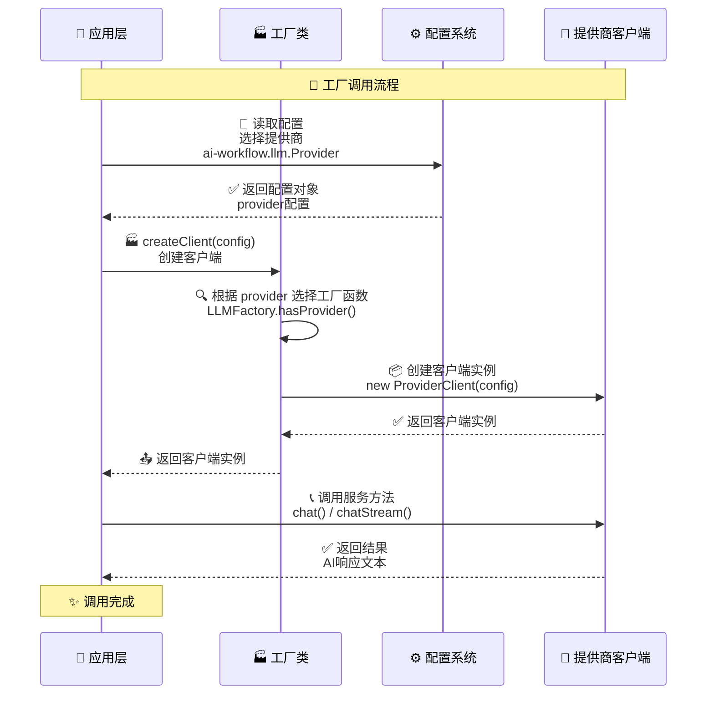

# 工厂系统文档

> **文件位置**：`src/factory/`  
> **可扩展性**：工厂系统是 XRK-AGT 的核心扩展点之一。通过工厂模式，开发者可以轻松接入新的 AI 服务提供商，实现统一的多厂商支持。详见 **[框架可扩展性指南](框架可扩展性指南.md)** ⭐
> **底层基线**：工厂层职责、调用链路与配置优先级以 **[底层架构设计](底层架构设计.md)** 为准。

XRK-AGT 采用**工厂模式**统一管理多种 AI 服务提供商，包括大语言模型（LLM）、语音识别（ASR）和语音合成（TTS）。工厂系统提供了统一的接口，屏蔽了不同厂商的 API 差异，让开发者可以轻松切换和扩展服务提供商。多模态识图能力由各家 LLM 自身的多模态接口提供，不再通过单独的「识图工厂」转发。

### 核心特性

- ✅ **统一接口**：所有工厂提供一致的 API，简化调用逻辑
- ✅ **多厂商支持**：每个工厂支持多个服务提供商，可动态切换
- ✅ **易于扩展**：通过 `registerProvider` 方法轻松注册新的提供商
- ✅ **配置驱动**：通过配置文件选择提供商，无需修改代码
- ✅ **自动路由**：根据配置自动选择对应的服务提供商
- ✅ **错误处理**：统一的错误处理和日志记录

---

## 📚 目录

- [架构概览](#架构概览)
- [工厂类型](#工厂类型)
- [配置说明](#配置说明)
- [扩展工厂](#扩展工厂)
- [工厂方法参考](#工厂方法参考)
- [使用场景](#使用场景)
- [最佳实践](#最佳实践)
- [常见问题](#常见问题)
- [AI HTTP API 路由](#ai-http-api-路由)
- [相关文档](#相关文档)

---

## 架构概览


### 工厂调用流程



---

## 工厂类型

### 1. LLMFactory（大语言模型工厂）

**文件位置**：`src/factory/llm/LLMFactory.js`

LLMFactory 负责管理所有大语言模型服务提供商，支持多种 LLM API 协议。

#### 支持的提供商（官方 + 兼容）

> 下表只列出「**工厂级别**」的官方 provider；所有兼容厂商（第三方代理 / New API / CherryIN / Ollama / 自建网关等）均通过 `*_compat_llm.yaml` 里的 `providers[].key` 动态扩展，这些 key 本身也会出现在 `LLMFactory.listProviders()` 与 `GET /v1/models` 中，可直接作为网关请求里的 `model` 使用。

| 类型 | 提供商 | 网关 `model` 示例 | 说明 | 官方文档 / 协议 | 多模态 |
|------|--------|--------------------|------|------------------|--------|
| 官方 | 火山引擎 | `volcengine` | 火山方舟 Responses（thinking；工具环走 harness） | `POST …/api/v3/responses` | ✅ |
| 官方 | 小米 MiMo | `xiaomimimo` | 兼容 OpenAI API 的 MiMo 大语言模型（仅文本） | OpenAI Chat Completions | ❌ |
| 官方 | OpenAI | `openai` | OpenAI 官方 Chat Completions 工厂，配置文件 `openai_llm.yaml` | `POST https://api.openai.com/v1/chat/completions` | ✅ |
| 官方 | Gemini | `gemini` | Google Generative Language API 工厂，配置文件 `gemini_llm.yaml` | `POST https://generativelanguage.googleapis.com/v1beta/models/{model}:generateContent` | ✅ |
| 官方 | Anthropic | `anthropic` | Claude Messages API 工厂，配置文件 `anthropic_llm.yaml` | `POST https://api.anthropic.com/v1/messages` | ✅ |
| 官方 | Azure OpenAI | `azure_openai` | Azure OpenAI Chat Completions 工厂，配置文件 `azure_openai_llm.yaml` | `POST https://{resource}.openai.azure.com/openai/deployments/{deployment}/chat/completions?api-version=...` | ✅ |
| 兼容 | OpenAI Chat 协议 | 例如：`my-openai-proxy` | 通过 `openai_compat_llm.yaml.providers[].key` 定义的任意 OpenAI-like Chat Completions（自定义 `baseUrl/path/apiKey`） | 完全兼容 `POST /v1/chat/completions` | 由网关决定 |
| 兼容 | OpenAI Responses 协议 | 例如：`my-responses-gateway` | 通过 `openai_responses_compat_llm.yaml.providers[].key` 定义的 Responses 兼容网关 | `POST /v1/responses` | 由网关决定 |
| 兼容 | New API / CherryIN | 例如：`newapi-main` / `cherry-cn` | 通过 `newapi_compat_llm.yaml` / `cherryin_compat_llm.yaml` 的 `providers[].key` 扩展 | OpenAI Chat Completions 风格 | 由网关决定 |
| 兼容 | Ollama | 例如：`ollama-local` | 通过 `ollama_compat_llm.yaml.providers[].key` 映射到本机 `http://127.0.0.1:11434/api/chat` | Ollama Chat API (`/api/chat`) | ✅（视模型而定） |
| 兼容 | Gemini / Anthropic / Azure 兼容工厂 | 例如：`gemini-alt` / `claude-alt` | `gemini_compat_llm.yaml` / `anthropic_compat_llm.yaml` / `azure_openai_compat_llm.yaml` 中的 `providers[].key` | 与各家官方协议完全一致 | ✅ |

**多模态说明**：
- 多模态能力由各家 LLM 自身的多模态接口提供（OpenAI / Gemini / Anthropic / Azure / 部分第三方网关 / Ollama 模型等）
- 主服务统一使用 OpenAI 风格的 `messages[].content = [{type:'text'},{type:'image_url', image_url:{url}}]` 结构；  
  每个工厂内部再通过 `transformMessagesWithVision` 转换为各家协议要求的格式（如 Gemini `parts.inlineData`、Anthropic `image` blocks、Ollama `images[]` base64 等）。

#### 基本用法

```javascript
import LLMFactory from '#factory/llm/LLMFactory.js';

// 创建客户端
const config = {
  provider: 'volcengine',  // 选择提供商
  apiKey: 'your-api-key',
  baseUrl: 'https://ark.cn-beijing.volces.com/api/v3',
  temperature: 0.7,
  maxTokens: 2000
};

const client = LLMFactory.createClient(config);

// 调用聊天接口
const messages = [
  { role: 'user', content: '你好' }
];

// 非流式调用
const response = await client.chat(messages);
console.log(response); // AI 回复文本

// 流式调用
const stream = await client.chatStream(messages, (chunk) => {
  process.stdout.write(chunk);
});
```

#### 客户端接口规范

所有 LLM 客户端必须实现以下接口：

```javascript
class LLMClient {
  /**
   * 非流式聊天
   * @param {Array} messages - 消息数组
   * @param {Object} overrides - 覆盖配置
   * @returns {Promise<string>} AI 回复文本
   */
  async chat(messages, overrides = {}) {}

  /**
   * 流式聊天
   * @param {Array} messages - 消息数组
   * @param {Function} onChunk - 数据块回调函数
   * @param {Object} overrides - 覆盖配置
   * @returns {Promise<string>} 完整回复文本
   */
  async chatStream(messages, onChunk, overrides = {}) {}
}
```

#### 特殊功能

- **Tool Calling**：`/v1` client `tools` 可由工厂透传；MCP schema/执行环在 `@xrkseek/harness`（`MCPToolAdapter` → ToolRegistry，见 [harness-module-loop.md](harness-module-loop.md)）。**执行前门禁**在 `MCPServer.handleToolCall`。
- **`maxToolRounds`**：办事助手 / `/v1`+MCP 映射为 harness `maxSteps`；工厂单次路径不消费该环。
- **variants / reasoning**：Provider 可配 `variant`/`variants` 与 reasoning budget；解析见 `provider-variant.js` · `reasoning-budget.js`（schema 在 `llm-provider-fields.js`）。
- **重试**：办事助手 / `/v1`+MCP 由 harness 步内 `llmRetry`（`llm.retry` → `resolveHarnessLlmRetry`）；工厂单次路径不跑外层 retry 环。HTTP 错误形状见 `llm-http-error.js`。
- **工作流作用域（streams）**：`POST /v1/chat/completions` 的 `workflow` → 白名单；有 workflows 时走 harness，无则工厂单次（透传 tool_calls）。
- **多模态输入**：部分 LLM（如 Volcengine、OpenAI、Gemini、Azure OpenAI 等）直接支持图片输入，消息结构会通过 `transformMessagesWithVision` 统一转成各家兼容的 `text + image_url`（含 base64 data URL）格式。

出站：`prepareOutboundMessages` 仅按 Provider `contextWindow` 裁剪；多轮压缩归 harness session（见 [agent-context.md](agent-context.md) §5 · [harness-module-loop.md](harness-module-loop.md)）。

---

### 2. ASRFactory（语音识别工厂）

**文件位置**：`src/factory/asr/ASRFactory.js`

ASRFactory 负责管理语音识别服务提供商，将语音转换为文本。

#### 支持的提供商

| 提供商 | 标识符 | 说明 |
|--------|--------|------|
| 火山引擎 | `volcengine` | 火山引擎语音识别服务，支持实时流式识别 |

#### 基本用法

```javascript
import ASRFactory from '#factory/asr/ASRFactory.js';

// 创建客户端
const config = {
  provider: 'volcengine',
  enabled: true,
  apiKey: 'your-api-key',
  appId: 'your-app-id',
  // ... 其他配置
};

const deviceId = 'device-001';
const client = ASRFactory.createClient(deviceId, config, AgentRuntime);

// 启动识别
await client.start();

// 发送音频数据
client.sendAudio(audioBuffer);

// 监听识别结果
client.on('result', (text) => {
  console.log('识别结果:', text);
});

// 停止识别
await client.stop();
```

#### 客户端接口规范

所有 ASR 客户端必须实现以下接口：

```javascript
class ASRClient {
  /**
   * 启动识别
   * @returns {Promise<void>}
   */
  async start() {}

  /**
   * 发送音频数据
   * @param {Buffer} audioData - 音频数据
   */
  sendAudio(audioData) {}

  /**
   * 停止识别
   * @returns {Promise<void>}
   */
  async stop() {}

  /**
   * 监听识别结果事件
   * @param {string} event - 事件名称（如 'result'）
   * @param {Function} callback - 回调函数
   */
  on(event, callback) {}
}
```

---

### 4. TTSFactory（语音合成工厂）

**文件位置**：`src/factory/tts/TTSFactory.js`

TTSFactory 负责管理语音合成服务提供商，将文本转换为语音。

#### 支持的提供商

| 提供商 | 标识符 | 说明 |
|--------|--------|------|
| 火山引擎 | `volcengine` | 火山引擎语音合成服务 |

#### 基本用法

```javascript
import TTSFactory from '#factory/tts/TTSFactory.js';

// 创建客户端
const config = {
  provider: 'volcengine',
  enabled: true,
  apiKey: 'your-api-key',
  appId: 'your-app-id',
  voice: 'zh_female_shuangkuaisisi_meet',
  // ... 其他配置
};

const deviceId = 'device-001';
const client = TTSFactory.createClient(deviceId, config, AgentRuntime);

// 合成语音
const text = '你好，我是语音助手';
const audioData = await client.synthesize(text);
console.log('音频数据:', audioData);
```

#### 客户端接口规范

所有 TTS 客户端必须实现以下接口：

```javascript
class TTSClient {
  /**
   * 合成语音
   * @param {string} text - 要合成的文本
   * @param {Object} options - 合成选项
   * @returns {Promise<Buffer>} 音频数据
   */
  async synthesize(text, options = {}) {}
}
```

---

## 配置说明

### 工厂配置位置

与工厂相关的 YAML 均在**当前 AgentRuntime 端口目录** `data/server_bots/{port}/` 下（端口由运行时 `runtimeConfig` 绑定，见 `src/infrastructure/config/config.js` 中 `getServerConfig` 与 `runtimeConfig.aiWorkflow`）：

1. **`ai-workflow.yaml`**：`llm.Provider` / `asr.Provider` / `tts.Provider` 等选择默认工厂提供商；另含工作流、MCP、子服务端等段（详见 `docs/ai-workflow.md`）。
2. **各提供商配置文件**（如 `volcengine_llm.yaml`）：API Key、模型名等具体参数。

### 配置示例

#### ai-workflow.yaml（端口目录内，非 `server_bots` 根目录）

```yaml
# LLM 工厂运营商选择
llm:
  Provider: volcengine  # 选择 LLM 提供商
  timeout: 360000
  retry:
    enabled: true
    maxAttempts: 3

# ASR 工厂运营商选择
asr:
  Provider: volcengine  # 选择 ASR 提供商
  workflow: device

# TTS 工厂运营商选择
tts:
  Provider: volcengine  # 选择 TTS 提供商
  onlyForASR: true
```

#### volcengine_llm.yaml（提供商配置）

```yaml
# 火山方舟 LLM：providers[]；model 填模型名或 ep- 接入点
providers:
  - key: volcengine
    apiKey: your-api-key
    baseUrl: https://ark.cn-beijing.volces.com/api/v3
    path: /responses
    model: doubao-seed-2-0-lite-260428   # 或 ep-xxxxxxxx / Seed 2.1 等现行 ID
    thinkingType: auto                   # enabled | disabled | auto
    temperature: 0.8
    maxTokens: 4096
```

### 配置读取

在代码中读取工厂配置：

```javascript
// 读取 LLM 配置
const llmConfig = AgentRuntime.runtimeConfig.aiWorkflow.llm;
const providerConfig = AgentRuntime.runtimeConfig[`${llmConfig.Provider}_llm`];

// 创建客户端
const client = LLMFactory.createClient({
  provider: llmConfig.Provider,
  ...providerConfig
});
```

---

## 扩展工厂

### 注册新的提供商

所有工厂都支持通过 `registerProvider` 方法注册新的提供商。

ASR/TTS 工厂由 `BaseFactory.createMediaFactoryClass()` 生成（`src/factory/BaseFactory.js`），对外 API 与下文一致；新增 ASR/TTS 厂商时实现客户端类并在对应 `*Factory.js` 的 `providers` Map 中注册，或运行时 `registerProvider`。

#### 示例：注册新的 LLM 提供商

```javascript
import LLMFactory from '#factory/llm/LLMFactory.js';
import MyCustomLLMClient from './MyCustomLLMClient.js';

// 注册提供商
LLMFactory.registerProvider('myprovider', (config) => {
  return new MyCustomLLMClient(config);
});

// 使用新提供商
const client = LLMFactory.createClient({
  provider: 'myprovider',
  apiKey: 'your-api-key',
  // ... 其他配置
});
```

### 实现客户端类

实现新的提供商客户端时，需要遵循对应的接口规范：

#### LLM 客户端实现示例

```javascript
export default class MyCustomLLMClient {
  constructor(config = {}) {
    this.config = config;
    this.endpoint = config.baseUrl + '/chat/completions';
  }

  async chat(messages, overrides = {}) {
    // 实现非流式聊天逻辑
    const response = await fetch(this.endpoint, {
      method: 'POST',
      headers: {
        'Content-Type': 'application/json',
        'Authorization': `Bearer ${this.config.apiKey}`
      },
      body: JSON.stringify({
        messages,
        model: this.config.model,
        ...overrides
      })
    });

    const data = await response.json();
    return data.choices[0].message.content;
  }

  async chatStream(messages, onChunk, overrides = {}) {
    // 实现流式聊天逻辑
    // ...
  }
}
```

### 在配置中启用新提供商

1. 在对应端口目录的 `data/server_bots/{port}/ai-workflow.yaml` 中将 `llm.Provider`（或 asr/tts）设为新提供商 key
2. 在同一端口目录创建提供商配置文件（如 `myprovider_llm.yaml`）
3. 在配置管理界面中配置 API Key 等参数

---

## 工厂方法参考

### LLMFactory

```javascript
class LLMFactory {
  /**
   * 注册自定义 LLM 提供商
   * @param {string} name - 提供商名称
   * @param {Function} factoryFn - 工厂函数，接收 config 参数，返回 LLM 客户端实例
   */
  static registerProvider(name, factoryFn)

  /**
   * 列出所有已注册的提供商
   * @returns {Array<string>} 提供商名称列表
   */
  static listProviders()

  /**
   * 检查提供商是否存在
   * @param {string} name - 提供商名称
   * @returns {boolean} 是否存在
   */
  static hasProvider(name)

  /**
   * 创建 LLM 客户端
   * @param {Object} config - 配置对象
   *   - provider: 提供商名称（如 'volcengine', 'openai'）
   *   - baseUrl: API 基础地址
   *   - apiKey: API 密钥
   *   - 其他 LLM 参数
   * @returns {Object} LLM 客户端实例
   */
  static createClient(config = {})
}
```

### ASRFactory

```javascript
class ASRFactory {
  /**
   * 注册自定义 ASR 提供商
   * @param {string} name - 提供商名称
   * @param {Function} factoryFn - 工厂函数，接收 (deviceId, config, AgentRuntime) 参数
   */
  static registerProvider(name, factoryFn)

  /**
   * 列出所有已注册的提供商
   * @returns {Array<string>} 提供商名称列表
   */
  static listProviders()

  /**
   * 检查提供商是否支持
   * @param {string} provider - 提供商名称
   * @returns {boolean} 是否支持
   */
  static isProviderSupported(provider)

  /**
   * 创建 ASR 客户端
   * @param {string} deviceId - 设备ID
   * @param {Object} config - 配置对象
   * @param {Object} AgentRuntime - AgentRuntime 实例
   * @returns {Object} ASR 客户端实例
   */
  static createClient(deviceId, config = {}, AgentRuntime)
}
```

### TTSFactory

```javascript
class TTSFactory {
  /**
   * 注册自定义 TTS 提供商
   * @param {string} name - 提供商名称
   * @param {Function} factoryFn - 工厂函数，接收 (deviceId, config, AgentRuntime) 参数
   */
  static registerProvider(name, factoryFn)

  /**
   * 列出所有已注册的提供商
   * @returns {Array<string>} 提供商名称列表
   */
  static listProviders()

  /**
   * 检查提供商是否支持
   * @param {string} provider - 提供商名称
   * @returns {boolean} 是否支持
   */
  static isProviderSupported(provider)

  /**
   * 创建 TTS 客户端
   * @param {string} deviceId - 设备ID
   * @param {Object} config - 配置对象
   * @param {Object} AgentRuntime - AgentRuntime 实例
   * @returns {Object} TTS 客户端实例
   */
  static createClient(deviceId, config = {}, AgentRuntime)
}
```

---

## 使用场景

### 场景 1：在 AiWorkflow 中使用 LLM 工厂

```javascript
import LLMFactory from '#factory/llm/LLMFactory.js';

class MyStream extends AiWorkflow {
  async process(e, question) {
    // 从配置读取 LLM 设置
    const llmConfig = this.getLLMConfig();
    
    // 创建 LLM 客户端
    const client = LLMFactory.createClient(llmConfig);
    
    // 调用 LLM
    const messages = [{ role: 'user', content: question }];
    const response = await client.chat(messages);
    
    return response;
  }
}
```

### 场景 2：在设备服务中使用 ASR/TTS 工厂

```javascript
import ASRFactory from '#factory/asr/ASRFactory.js';
import TTSFactory from '#factory/tts/TTSFactory.js';

// 创建 ASR 客户端
const asrConfig = AgentRuntime.runtimeConfig.device.asr;
const asrClient = ASRFactory.createClient(deviceId, asrConfig, AgentRuntime);

// 创建 TTS 客户端
const ttsConfig = AgentRuntime.runtimeConfig.device.tts;
const ttsClient = TTSFactory.createClient(deviceId, ttsConfig, AgentRuntime);
```

### 场景 3：在 HTTP API 中使用工厂

XRK-AGT 提供了标准运营商 LLM 网关，位于 `core/system-Core/http/ai.js`（均需 API Key，`systemAuth: 'ai.v1'`）：

**OpenAI Chat Completions**（推荐）：
```javascript
// POST /v1/chat/completions
const response = await fetch('http://localhost:8080/v1/chat/completions', {
  method: 'POST',
  headers: {
    'Content-Type': 'application/json',
    'Authorization': 'Bearer YOUR_API_KEY'
  },
  body: JSON.stringify({
    model: 'volcengine',  // provider key
    messages: [
      { role: 'user', content: '你好' }
    ],
    stream: false  // 或 true 启用 SSE
  })
});
```

**Anthropic / Responses**：
```javascript
// POST /v1/messages · POST /v1/responses（及 /openai/v1/... 别名）
```

**控制台 LLM 目录**（`ai-workspace.js`，需 Key）：
```javascript
// GET /api/ai/models
const response = await fetch('http://localhost:8080/api/ai/models', {
  headers: { 'Authorization': 'Bearer YOUR_API_KEY' }
});
const data = await response.json();
console.log(data.profiles);   // LLM 提供商列表
console.log(data.workflows);  // 工作流列表
```

**自定义 HTTP API 中使用工厂**：
```javascript
import LLMFactory from '#factory/llm/LLMFactory.js';

export default {
  path: '/api/chat',
  method: 'POST',
  async handler(req, res) {
    const { messages, provider } = req.body;
    
    // 根据请求选择提供商
    const config = {
      provider: provider || 'volcengine',
      ...AgentRuntime.runtimeConfig[`${provider}_llm`]
    };
    
    const client = LLMFactory.createClient(config);
    const response = await client.chat(messages);
    
    res.json({ response });
  }
};
```

---

## 最佳实践

### 1. 配置管理

- ✅ 使用配置文件管理提供商选择，避免硬编码
- ✅ 将敏感信息（API Key）存储在配置文件中，不要提交到代码仓库
- ✅ 使用环境变量或配置管理界面管理不同环境的配置

### 2. 错误处理

- ✅ 始终使用 try-catch 包裹工厂调用
- ✅ 检查提供商是否存在（使用 `hasProvider` 方法）
- ✅ 提供友好的错误提示

```javascript
try {
  if (!LLMFactory.hasProvider(provider)) {
    throw new Error(`不支持的提供商: ${provider}`);
  }
  const client = LLMFactory.createClient(config);
  const response = await client.chat(messages);
} catch (error) {
  AgentRuntime.makeLog('error', `LLM调用失败: ${error.message}`);
  throw error;
}
```

### 3. 性能优化

- ✅ 复用客户端实例，避免频繁创建
- ✅ 使用流式接口处理长文本响应
- ✅ 合理设置超时时间

### 4. 扩展开发

- ✅ 遵循接口规范，确保兼容性
- ✅ 提供完整的错误处理和日志记录
- ✅ 编写单元测试验证功能
- ✅ 在文档中说明新提供商的特性和限制

---

## 常见问题

### Q: 如何切换 LLM 提供商？

A: 修改**当前端口**下 `data/server_bots/{port}/ai-workflow.yaml` 中的 `llm.Provider` 字段，然后重启服务或重新加载配置。

### Q: 如何添加新的 LLM 提供商？

A: 
1. 实现新的 LLM 客户端类（继承接口规范）
2. 使用 `LLMFactory.registerProvider()` 注册提供商
3. 创建对应的配置文件（如 `myprovider_llm.yaml`）
4. 在该端口目录的 `ai-workflow.yaml` 中将对应 `*.Provider` 设为新提供商

### Q: 如何查看当前支持的所有提供商？

A: 使用工厂的 `listProviders()` 方法：

```javascript
console.log(LLMFactory.listProviders());
console.log(ASRFactory.listProviders());
console.log(TTSFactory.listProviders());
```

### Q: 工厂客户端是单例吗？

A: 每次 `createClient()` 返回新实例；需要复用时由调用方缓存。

---

## AI HTTP API 路由

XRK-AGT 标准 LLM 网关位于 `core/system-Core/http/ai.js`（`systemAuth: 'ai.v1'`）。控制台目录在 `ai-workspace.js`。

### OpenAI Chat Completions

**POST `/v1/chat/completions`**（别名 `/openai/v1/chat/completions`）

完全兼容 OpenAI Chat Completions API，支持流式和非流式输出。

**请求示例**（非流式）：
```http
POST /v1/chat/completions HTTP/1.1
Host: localhost:8080
Content-Type: application/json
Authorization: Bearer YOUR_API_KEY

{
  "model": "volcengine",
  "messages": [
    { "role": "user", "content": "你好" }
  ],
  "stream": false,
  "temperature": 0.7,
  "max_tokens": 2000
}
```

**响应示例**：
```json
{
  "id": "chatcmpl_1703123456789",
  "object": "chat.completion",
  "created": 1703123456,
  "model": "volcengine",
  "choices": [{
    "index": 0,
    "message": {
      "role": "assistant",
      "content": "你好！有什么可以帮助你的吗？"
    },
    "finish_reason": "stop"
  }],
  "usage": {
    "prompt_tokens": 2,
    "completion_tokens": 10,
    "total_tokens": 12
  }
}
```

**流式输出**（`stream: true`）：
```http
POST /v1/chat/completions HTTP/1.1
Content-Type: application/json
Authorization: Bearer YOUR_API_KEY

{
  "model": "volcengine",
  "messages": [{ "role": "user", "content": "你好" }],
  "stream": true
}
```

**响应**（Server-Sent Events，末尾 `data: [DONE]`）：
```
data: {"id":"chatcmpl_...","object":"chat.completion.chunk","created":1703123456,"model":"volcengine","choices":[{"index":0,"delta":{"role":"assistant","content":"你"},"finish_reason":null}]}

data: {"id":"chatcmpl_...","object":"chat.completion.chunk","created":1703123456,"model":"volcengine","choices":[{"index":0,"delta":{"content":"好"},"finish_reason":null}]}

data: {"id":"chatcmpl_...","object":"chat.completion.chunk","created":1703123456,"model":"volcengine","choices":[{"index":0,"delta":{},"finish_reason":"stop","usage":{...}}]}

data: [DONE]
```

**重要说明**：

- `model` 参数使用 **provider 名称**（如 `volcengine`、`openai`），不是真实模型名；真实模型由各 `*_llm` 配置文件中的 `model/chatModel` 决定。
- 支持多种认证方式：`Authorization: Bearer TOKEN`、请求体 `apiKey` / `api_key`、以及 `X-API-Key` 头。详见 [AUTH.md](AUTH.md)。
- 支持常见 OpenAI 兼容参数：`temperature`、`max_tokens`、`top_p`、`tools`、`tool_choice`、`parallel_tool_calls`、`response_format`、`stream_options` 等。
- 另有：`POST /v1/messages`（Anthropic）、`POST /v1/responses`（Responses；`store=false`）。
- **工具作用域控制（streams）**：
  - 前端/调用方可以在请求体中提供 `workflow` 字段，例如：
    ```json
    {
      "workflow": {
        "workflows": ["chat", "desktop"]
      }
    }
    ```
  - 有 `workflows` 时走 `@xrkseek/harness`（`runHarnessModuleLoop`）；无则工厂单次补全（`tool_calls` 透传、不执行）。未出现在白名单中的工作流工具**不会被注册/调用**。

### 模型和工作流列表

**GET `/api/ai/models`**（`systemAuth: 'ai.models.catalog'`）

获取控制台用 LLM 提供商与工作流列表。

**请求示例**：
```http
GET /api/ai/models HTTP/1.1
Host: localhost:8080
Authorization: Bearer YOUR_API_KEY
```

**GET `/v1/models`**

OpenAI 格式的模型列表（用于兼容 OpenAI 客户端）。

**请求示例**：
```http
GET /v1/models HTTP/1.1
Host: localhost:8080
Authorization: Bearer YOUR_API_KEY
```

**响应示例**：
```json
{
  "object": "list",
  "data": [
    {
      "id": "openai",
      "object": "model",
      "created": 1703123456,
      "owned_by": "xrk-agt"
    },
    {
      "id": "volcengine",
      "object": "model",
      "created": 1703123456,
      "owned_by": "xrk-agt"
    }
  ]
}
```

> **已移除**：`/api/v3/*`、`GET /api/ai/stream`。流式对话请用 `POST /v1/chat/completions` + `stream: true`。

---

## 相关文档

- **[Agent 运行链与上下文](agent-context.md)** - 出站压缩、策略安全、工具环契约 ⭐
- **[system-Core 特性](system-core.md)** - system-Core 内置模块完整说明，包含AI服务API和所有工作流的实际实现 ⭐
- **[AiWorkflow 文档](ai-workflow.md)** - AiWorkflow 基类技术文档，了解如何在 AiWorkflow 中使用 LLM 工厂
- **[配置基类文档](config-base.md)** - 了解配置系统的使用
- **[MCP 完整指南](mcp-guide.md)** - MCP 工具注册与连接
- **[HTTP API 文档](http-api.md)** - 了解 HTTP API 基类
- **[框架可扩展性指南](框架可扩展性指南.md)** - 扩展开发完整指南
- Coding：skill `xrk-llm` · `xrk-ai-workflow`（`.cursor/skills/`）

---

*最后更新：2026-08-17（网关改为 `/v1/*`；移除 `/api/v3` 与 `/api/ai/stream`）*
