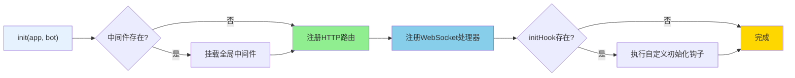

# HTTP API 基类文档

> **文件位置**：`src/infrastructure/http/http.js`  
> **基类契约**：[base-classes.md](base-classes.md) · **加载器**：[api-loader.md](api-loader.md) · [infrastructure-shared.md](infrastructure-shared.md)  
> **可扩展性**：[框架可扩展性指南](框架可扩展性指南.md)

`HttpApi` 是 XRK-AGT 中的 **HTTP API 基类**，用于统一定义 REST 路由、WebSocket 处理器、中间件等。

所有位于 `core/*/http` 目录下的 API 模块都可以：
- **直接导出对象（推荐）**：由 `HttpApiLoader` 自动包装为 `HttpApi` 实例
- **继承 HttpApi 类**：手动控制初始化逻辑，适合复杂场景

### 核心特性

- ✅ **零配置扩展**：放置到任意 `core/*/http/` 目录即可自动加载
- ✅ **标准化接口**：统一的基类和接口规范
- ✅ **灵活路由**：支持REST API和WebSocket
- ✅ **中间件支持**：支持全局和路由级中间件
- ✅ **热重载支持**：修改代码后自动重载
- ✅ **System-Core 默认鉴权**：`HttpApi` 对路径以 `/api/` 开头的路由自动调用 `AgentRuntime.checkApiAuthorization(req)`（见 `route.systemAuth` / `src/infrastructure/http/http.js`）；显式设置 `systemAuth: false` 可关闭。其他 Core 可按需自定义（详见 [AUTH.md](AUTH.md)）

---

## 架构概览


路由注册、`systemAuth` 与 `HttpResponse` 细节见下文各节；加载流程见 [api-loader.md](api-loader.md)。

---

## 构造参数

```javascript
constructor(data = {})
```

**参数说明**：

| 参数 | 类型 | 说明 | 默认值 |
|------|------|------|--------|
| `name` | `string` | API名称（必填，用于标识和日志） | `'unnamed-api'` |
| `dsc` | `string` | API描述 | `'暂无描述'` |
| `routes` | `Array` | 路由配置数组 | `[]` |
| `priority` | `number` | 优先级（数字越大优先级越高） | `100` |
| `enable` | `boolean` | 是否启用 | `true` |
| `init` | `Function` | 自定义初始化钩子 `(app, bot) => {}` | `null` |
| `ws` | `Object` | WebSocket处理器 `{ '/path': handler \| [handlers] }` | `{}` |
| `middleware` | `Array` | 全局中间件数组（在路由注册前执行） | `[]` |

**路由配置** (`routes` 数组元素)：

| 字段 | 类型 | 说明 |
|------|------|------|
| `method` | `string` | HTTP方法（GET/POST/PUT/DELETE等，不区分大小写） |
| `path` | `string` | 路由路径（如 `/api/example/ping`） |
| `handler` | `Function` | 处理函数 `(req, res, bot, next) => {}` |
| `systemAuth` | `string \| false` | 可选。字符串为鉴权日志上下文；`false` 关闭鉴权；省略且 `path` 以 `/api/` 开头时由基类自动启用系统 API Key |
| `middleware` | `Array` | 可选的路由级中间件数组 |

**内部属性**（由框架自动设置）：

- `this.createTime` - 创建时间戳
- `this.wsHandlers` - WebSocket处理器集合（从 `ws` 参数初始化）
- `this.initHook` - 初始化钩子函数（从 `init` 参数初始化）

---

## 核心方法

### `async init(app, bot)`

初始化API，注册路由和WebSocket处理器。



**执行流程**：
1. 挂载全局中间件（如果存在）
2. 注册HTTP路由
3. 注册WebSocket处理器
4. 执行自定义初始化钩子（如果存在）

**返回值**：`Promise<boolean>` - 始终返回 `true`

### `registerRoutes(app, bot)`

注册HTTP路由到Express应用。

**流程**：
1. 验证 `routes` 数组
2. 遍历每个路由，验证 `method`、`path`、`handler`
3. 使用 `wrapHandler` 包装处理函数（自动注入 `req.agentRuntime` 和 `req.api`）
4. 注册到Express（支持路由级中间件）

**处理函数签名**：
```javascript
async (req, res, bot, next) => {
  // req.agentRuntime - AgentRuntime实例（已自动注入）
  // req.api - 当前API实例（已自动注入）
  // bot - AgentRuntime实例（参数传递）
  // next - Express next函数（可选）
  
  // 推荐：统一 HttpResponse
  import { HttpResponse } from '#utils/http-utils.js';
  return HttpResponse.success(res, result);
}
```

**错误处理**：
- 自动捕获handler内部错误并记录日志
- 若响应未发送，返回500 JSON错误（开发环境包含错误详情）
- 若响应已发送，只记录警告日志

### `wrapHandler(handler, bot)`

包装路由处理函数，注入上下文并处理错误。

**注入的上下文**：
- `req.agentRuntime = bot` - AgentRuntime实例
- `req.api = this` - 当前API实例

### `registerWebSocketHandlers(bot)`

注册WebSocket处理器到 `bot.wsf`。

**WebSocket配置格式**：
```javascript
ws: {
  '/ws/chat': handler,                    // 单个处理器
  '/ws/notify': [handler1, handler2]      // 多个处理器（数组）
}
```

**处理函数签名**：
```javascript
(conn, req, bot, socket, head) => {
  conn.on('message', (msg) => {
    conn.sendMsg('响应消息');
  });
}
```

**错误处理**：自动捕获异常并记录日志，不会导致连接断开

### `getInfo()`

返回API信息对象，包含 `name`、`dsc`、`priority`、`routes`数量、`ws`数量、`enable`、`createTime`。

**返回格式**：
```javascript
{
  name: string,        // API名称
  dsc: string,         // API描述
  priority: number,    // 优先级
  routes: number,      // 路由数量
  ws: number,          // WebSocket处理器数量
  enable: boolean,     // 是否启用
  createTime: number   // 创建时间戳
}
```

### `start()` / `stop()` / `async reload(app, bot)`

- `start()` - 启用API（设置 `enable = true`）
- `stop()` - 停用API（设置 `enable = false`）
- `reload(app, bot)` - 重载API（stop → init → start）

> **注意**：文件级别的重载由 `HttpApiLoader` 负责，`reload` 更适用于逻辑级微调。

---

## 使用示例

### 方式1：对象导出（推荐）

```javascript
// core/my-core/http/example.js
export default {
  name: 'example-api',
  dsc: '示例 API',
  priority: 100,
  
  // 全局中间件（可选）
  middleware: [
    (req, res, next) => {
      // 全局中间件逻辑
      next();
    }
  ],
  
  // HTTP路由
  routes: [
    {
      method: 'GET',
      path: '/api/example/ping',
      handler: async (req, res, bot) => {
        // req.agentRuntime 和 req.api 已自动注入
        res.json({
          success: true,
          message: 'pong',
          botOnline: bot.uin?.length > 0,
          apiName: req.api.name
        });
      }
    },
    {
      method: 'POST',
      path: '/api/example/echo',
      middleware: [(req, res, next) => next()], // 路由级中间件
      handler: async (req, res, bot) => {
        const { message } = req.body;
        res.json({ success: true, echo: message });
      }
    }
  ],
  
  // WebSocket处理器（可选）
  ws: {
    '/ws/example': (conn, req, bot) => {
      conn.on('message', (msg) => {
        conn.sendMsg(`echo: ${msg}`);
      });
    }
  },
  
  // 自定义初始化钩子（可选）
  init: async (app, bot) => {
    console.log('Example API 初始化完成');
  }
};
```

### 方式2：继承HttpApi类

```javascript
// core/my-core/http/advanced-api.js
import HttpApi from '#infrastructure/http/http.js';

export default class AdvancedAPI extends HttpApi {
  constructor() {
    super({
      name: 'advanced-api',
      dsc: '高级API示例',
      priority: 200,
      routes: [
        {
          method: 'GET',
          path: '/api/advanced/status',
          handler: this.handleStatus.bind(this)
        }
      ]
    });
  }
  
  async handleStatus(req, res, bot) {
    const info = this.getInfo();
    res.json({ success: true, api: info });
  }
}
```

### 方式3：调用工作流系统（配合 HttpResponse）

```javascript
// core/my-core/http/ai-chat-api.js
import AiWorkflowLoader from '#infrastructure/ai-workflow/loader.js';
import { HttpResponse } from '#utils/http-utils.js';

export default {
  name: 'ai-chat-api',
  routes: [
    {
      method: 'POST',
      path: '/api/ai/chat', // 自定义 Core 示例；内置 AI 见 system-Core/http/ai.js
      handler: HttpResponse.asyncHandler(async (req, res, bot) => {
        const { message, streamName = 'chat' } = req.body;
        const stream = AiWorkflowLoader.getWorkflow(streamName);
        if (!stream) return HttpResponse.notFound(res, '工作流未找到');
        
        const e = {
          user_id: req.user?.id || 'web_user',
          msg: message,
          reply: async (msg) => {
            HttpResponse.success(res, { response: msg });
          }
        };
        
        await stream.process(e, message, {
          enableMemory: true,
          enableDatabase: true
        });
      }, 'ai-chat-api.chat')
    }
  ]
};
```

> **注意**：API文件放置在 `core/*/http/` 目录后，`HttpApiLoader` 会自动加载并注册。

---

## 与其他系统的集成

### 中间件执行顺序

所有 `HttpApi` 路由都运行在 **AgentRuntime 的中间件栈之后**（CORS、安全头、认证等已处理）。

### 常见集成模式

**调用工作流系统（推荐配合 HttpResponse）**：
```javascript
import AiWorkflowLoader from '#infrastructure/ai-workflow/loader.js';
import { HttpResponse } from '#utils/http-utils.js';

handler: HttpResponse.asyncHandler(async (req, res, bot) => {
  const stream = AiWorkflowLoader.getWorkflow('chat');
  if (!stream) return HttpResponse.notFound(res, '工作流未找到');

  const e = {
    user_id: req.user?.id || 'web_user',
    msg: req.body.message,
    reply: async (msg) => HttpResponse.success(res, { response: msg })
  };

  await stream.process(e, req.body.message, {
    enableMemory: true,
    enableDatabase: true
  });
}, 'chat-api.chat')
```

**桥接到插件系统**：
```javascript
handler: async (req, res, bot) => {
  const e = {
    event_id: `api_${Date.now()}`,
    tasker: 'stdin',
    user_id: req.user?.id || 'api_user',
    msg: req.body.message,
    reply: async (msg) => res.json({ success: true, response: msg })
  };
  bot.em('stdin.message', e);
}
```

**配置管理接口**：
```javascript
import MyConfig from '#infrastructure/commonconfig/myconfig.js';

handler: async (req, res, bot) => {
  const config = new MyConfig();
  if (req.method === 'GET') {
    const data = await config.read();
    res.json({ success: true, data });
  } else if (req.method === 'POST') {
    await config.write(req.body);
    res.json({ success: true });
  }
}
```

---

## HTTP 业务层开发建议

以下建议适用于在 `core/*/http/` 下新增或维护 API 模块，与 system-Core 现有实现保持一致，便于维护和排查。

### 1. 鉴权：位置清晰、不做重复校验

- system-Core 下的 HTTP API 在各自模块内通过 `AgentRuntime.checkApiAuthorization(req)` 统一使用系统级 API Key（详见 **[AUTH.md](AUTH.md)**）。
- 其他 Core 的 HTTP 模块可以选择接入系统级 API Key，或实现自有鉴权方案，但应保持“**一处判断、避免重复**”的原则：不要既在 Server 层又在业务 handler 内多次判断同一层级的 Key。

### 2. 响应格式：统一用 HttpResponse

- **成功**：`HttpResponse.success(res, data, message)`：
  - 始终：`{ success: true, message }`。
  - **普通对象**（非数组）：字段**拍平到顶层** → `{ success, message, ...data }`（**没有**统一外层 `data`）。
  - **数组 / 标量**：→ `{ success, message, data: <值> }`。
  - **`null`**：仅 `success` + `message`。
  - 业务需要顶层 `data` 字段时：显式 `success(res, { data: payload })`。
  - **前端**：勿默认 `json.data` 再读字段；`/xrk` 用 `unwrapSuccess`（`web-compat.js`），产品页内联或读顶层。见 skill **`xrk-www-compat`**。
- **原样 JSON**（兼容端点）：`HttpResponse.json(res, body)`，不包 `success` 外壳（如 `/api/stdin/command`）。
- **错误**：`HttpResponse.error(res, error, statusCode, context)`、`HttpResponse.validationError(res, message)`、`HttpResponse.notFound(res, message)`、`HttpResponse.forbidden(res, message)` 等，格式统一为 `{ success: false, message, code }`。
- **避免**在 handler 里直接 `res.status(200).json({ ... })` 或手写错误 JSON，以便日志与前端解析一致。

### 3. Handler 包装与错误捕获

- 所有异步 handler 建议用 **`HttpResponse.asyncHandler(handler, context)`** 包装，可自动捕获未处理异常并返回 500 + 统一错误体；`context` 用于日志（如 `'config.read'`、`'file.upload'`），便于排查。
- 在 handler 内部：校验失败时 **尽早 `return HttpResponse.xxx(...)`**，避免继续执行导致重复写响应或逻辑混乱。

```javascript
import { HttpResponse } from '#utils/http-utils.js';

routes: [
  {
    method: 'GET',
    path: '/api/example/:id',
    handler: HttpResponse.asyncHandler(async (req, res, AgentRuntime) => {
      const id = req.params.id;
      if (!id) return HttpResponse.validationError(res, '缺少 id');
      const item = await getItem(id);
      if (!item) return HttpResponse.notFound(res, '资源不存在');
      HttpResponse.success(res, { item });
    }, 'example.get')
  }
]
```

### 4. 路由与命名约定

- **路径**：以 `/api/` 开头，按资源或模块划分，如 `/api/config/:name/read`、`/api/bots`；同一资源的 CRUD 保持 REST 风格（GET 查、POST 增/写、PUT/PATCH 改、DELETE 删）。
- **方法**：与语义一致（查询用 GET、修改用 POST/PUT、删除用 DELETE），避免用 GET 传敏感参数（走 query 易被记录）。
- **asyncHandler 的 context**：建议 `'模块.动作'` 小写，如 `'config.read'`、`'plugin.reload'`，便于日志过滤。

### 5. 参数与输入校验

- **必填参数缺失**：直接 `return HttpResponse.validationError(res, '缺少 xxx 参数')`，不要继续执行业务。
- **敏感或复杂输入**：使用 `InputValidator`（如 `validateUserId`、`validatePath`）做格式与安全校验，失败时同样返回 `validationError` 或 `forbidden`。
- **从 `req` 取参**：`req.params`（路径）、`req.query`（查询）、`req.body`（体）；取前可做 `req.body || {}` 防止 undefined。

### 6. 异步与性能

- Handler 内 **一律使用 async/await**，避免在回调里忘记返回或错误未捕获。
- **不要在 handler 内做长时间同步阻塞**（如大文件同步读、密集计算）；耗时操作放到异步流程或队列，必要时用 `init()` 里启动的定时器/Worker 处理。
- 需要依赖 AgentRuntime、配置、数据库时，在 handler 内按需 `import` 或使用已注入的 `AgentRuntime`，避免在模块顶层执行副作用。

### 7. 模块结构建议

- 每个 API 模块导出 **`name`、`dsc`、`priority`、`routes`**；需要时加 `init`、`ws`、`middleware`。
- **路由数组**保持扁平，单文件内路由不宜过多；若路由很多，可拆成多个 `core/*/http/*.js` 文件，用 `priority` 和 path 前缀区分。
- 与配置、插件、工作流等交互时，优先使用框架提供的 **CommonConfigRegistry、PluginLoader、AiWorkflowLoader** 等入口，避免直接读文件或维护多份状态。

### 8. 参考实现

- **配置类**：`core/system-Core/http/config.js`（统一 getConfig、resolveConfigInstance、无鉴权重复）。
- **列表与控制**：`core/system-Core/http/bot.js`（collectBotInventory、参数校验、HttpResponse 统一返回）。
- **文件与上传**：`core/system-Core/http/files.js`（multipart、路径校验、统一响应结构）。
- **插件与统计**：`core/system-Core/http/plugin.js`（getPluginsWithSummary、避免 summary/stats 重复逻辑）。

---

## 最佳实践（小结）

1. **业务逻辑分层**：业务逻辑沉淀在插件与工作流中，HTTP 层提供入口和管理界面。
2. **统一响应与错误**：使用 `HttpResponse` 与 `asyncHandler`，保持 `{ success, message, code }` 等格式一致。
3. **鉴权位置清晰**：system-Core HTTP 在模块内统一使用系统级 API Key（`AgentRuntime.checkApiAuthorization(req)`），其他 Core 可按需接入或自定义鉴权。
4. **与前端协作**：统一 JSON、必填/可选参数清晰，关键接口可在文档或 system-Core 说明中列出。

---

## 相关文档

- **[API加载器](api-loader.md)** - API 自动加载和热重载机制
- **[system-Core 特性](system-core.md)** - system-Core 内置模块完整说明，包含 **11 个** HTTP API 模块的实际示例
- **[鉴权与认证（AUTH）](AUTH.md)** - 系统级 API Key 与各层职责划分
- **[HTTP业务层](http-business-layer.md)** - 重定向、CDN、反向代理增强功能
- **[Server服务器架构](server.md)** - 完整的服务器架构说明
- **[框架可扩展性指南](框架可扩展性指南.md)** - 扩展开发完整指南

---

*最后更新：2026-06-14*