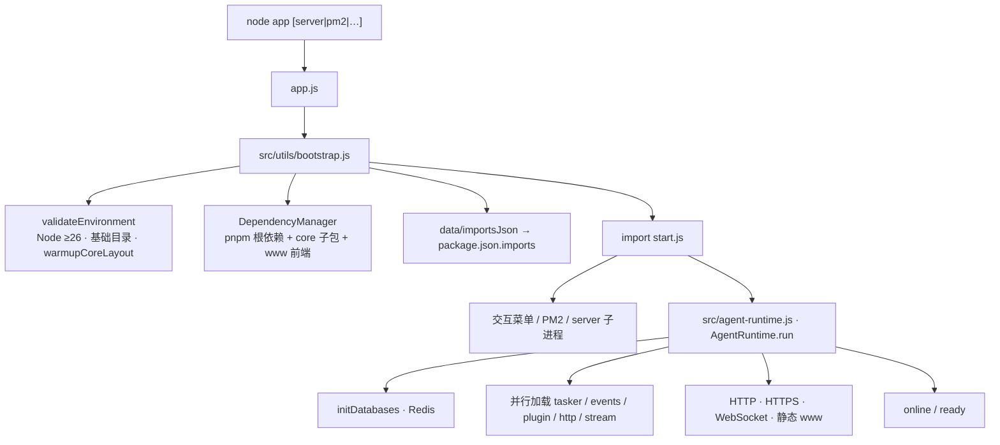

# 启动与引导

> **定位**：XRK-AGT 是**融合智能体业务逻辑的通用后端**；本页描述从 `node app` 到 AgentRuntime 在线的引导链。架构边界见 [底层架构设计](底层架构设计.md)。

---

## 启动链

| 阶段 | 文件 | 职责 |
|------|------|------|
| 入口 | `app.js` | `new Bootstrap().run()` |
| 引导 | `src/utils/bootstrap.js` | 环境、依赖、动态 imports |
| 菜单 / 进程 | `start.js` | 端口选择、Playwright 浏览器、PM2、Ctrl+C 语义 |
| 运行时 | `src/agent-runtime.js` | 服务、加载器、全局 `AgentRuntime` |

引导日志：`logs/bootstrap.log`（`src/utils/simple-logger.js`）。

**配置与代码变更**：YAML、插件、工作流、模板均无热重载；修改后需 **重启进程**。见 [ADR-0004](adr/0004-typescript-dist-no-hot-reload.md)。

---

## Bootstrap 步骤

实现位于 `src/utils/bootstrap.js`（`app.js` 仅一行调用）。

**按入口分流**（`process.argv[2] === 'server'`）：

| 入口 | 行为 |
|------|------|
| `node app`（菜单） | 仅环境验证（Node ≥ 26、目录预热），尽快进菜单 |
| `node app server`（含 Ctrl+C 热重启子进程） | 完整依赖检查后再加载 `start.js` |

**server 依赖步骤**（`src/utils/bootstrap-deps.js`，跨平台见 `src/utils/command-spawn.js`）：

1. 根目录 `package.json` 缺失项 → **仅 pnpm install**（`PUPPETEER_SKIP_DOWNLOAD` 默认 `true`）。
2. `core/*` 含 `package.json` 的子包各自 `pnpm install`。
3. `core/*/www/<app>/` 前端依赖（`XRK_SKIP_FRONTEND_BOOTSTRAP=1` 可跳过；冷/热启动默认都会查）。
4. **启动过程 stale www build**（`XRK_SKIP_WWW_BUILD=1` 可跳过；冷/热启动默认都会按需编）。
5. **不在引导阶段安装 Playwright Chromium**；见下方「Playwright 浏览器」。
6. 合并 `data/importsJson/*.json` 的 `imports` 到根 `package.json`。

---

## start.js 与 AgentRuntime

- **交互菜单**：选端口、启停服务、Playwright 浏览器安装、`pnpm run setup:browsers` 等价入口。
- **server 模式**：子进程跑 AgentRuntime，便于开发热重启。
- **信号**：Ctrl+C 在服务端 **1 次重启 / 3 次回菜单**（`src/utils/process-signals.js`），详见 [agent-runtime.md](bot.md#关闭流程与-ctrlc)。
- **Windows UTF-8**：`src/utils/win-utf8.js`（菜单与日志共用）。

`AgentRuntime.run()` 内大致顺序：读配置 → `initDatabases`（见 [database.md](database.md)）→ 加载 Tasker / 监听器 / 插件 / HTTP / 工作流 → 监听 HTTP/WS → 触发 `online`。

---

## 环境变量

| 变量 | 作用 |
|------|------|
| `XRK_SKIP_CONFIG_CHECK=1` | 跳过端口配置检查（热重启由父进程设置） |
| `XRK_SKIP_FRONTEND_BOOTSTRAP=1` | 跳过 `core/*/www` 前端依赖检查 |
| `XRK_SKIP_WWW_BUILD=1` | 跳过启动过程 stale www build |
| `XRK_SKIP_FRONTEND_START=1` | 跳过前端 dev server |
| `PUPPETEER_SKIP_DOWNLOAD` | 覆盖 Puppeteer Chromium 下载（默认 `true`） |

---

## Playwright 浏览器

默认渲染器为 **Playwright**（`agt.browser.renderer`）。Chromium **可选**安装：

- 启动菜单「Playwright 浏览器」
- `pnpm run setup:browsers`

Puppeteer 为可选渲染器；引导阶段不会自动下载浏览器。

---

## 进一步阅读

- [app-dev.md](app-dev.md) — Web 控制台、前后端协作、runtimeConfig 用法  
- [agent-runtime.md](agent-runtime.md) — AgentRuntime 生命周期、中间件、关闭流程  
- [database.md](database.md) — Redis（含 `scripts/ensure-redis.mjs` 探测/拉起）  
- [底层架构设计](底层架构设计.md) — 分层与工具模块表  

---

*最后更新：2026-09-05*
