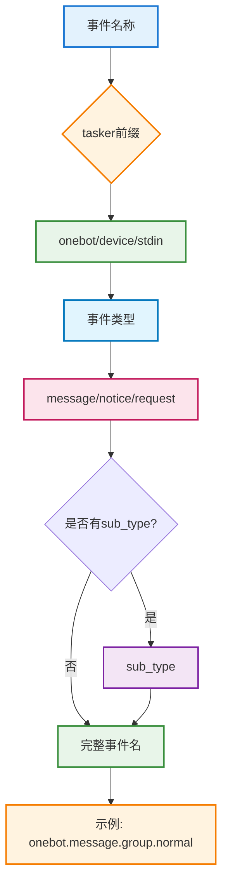
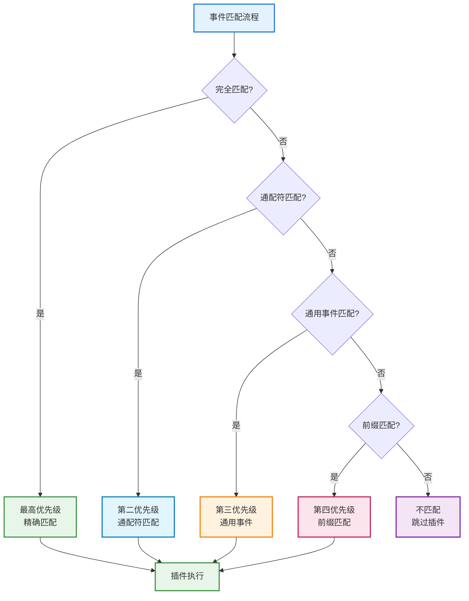
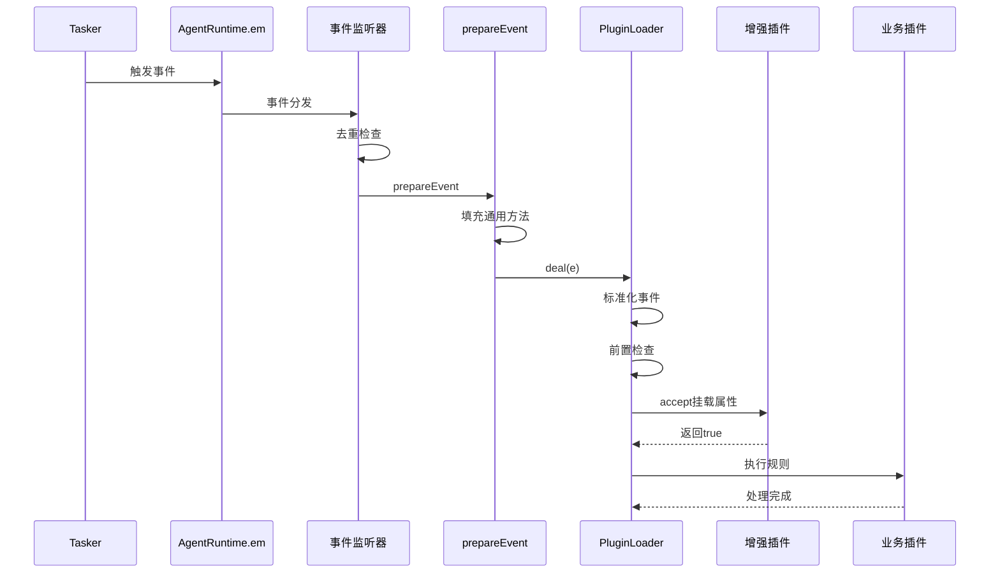
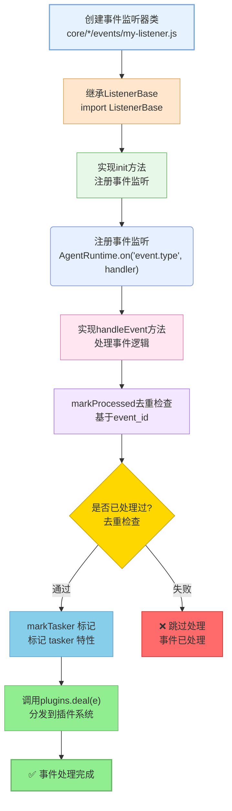

# 事件系统标准化文档

| 项 | 说明 |
|----|------|
| **业务实现** | `core/*/events/*.js`（ListenerLoader 扫描） |
| **基类** | `src/infrastructure/listener/base.js`（`ListenerBase`） |
| **加载器** | `src/infrastructure/listener/loader.js` |

通过继承 `ListenerBase` 创建自定义事件监听器。详见 **[框架可扩展性指南](框架可扩展性指南.md)** ⭐

本文档涵盖事件系统的命名规范、字段责任边界、处理流程以及事件监听器的开发指南。

## 📚 目录

- [命名与匹配](#命名与匹配)
- [字段责任边界](#字段责任边界)
- [处理流程速览](#处理流程速览)
- [创建事件监听器](#创建事件监听器)
- [相关文档](#相关文档)

---

## 命名与匹配

**事件命名结构**:



**匹配优先级**:



**命名规范**：
- 结构：`{tasker}.{post_type}.{detail?}.{sub_type?}`，示例 `onebot.message.group.normal`
- Tasker 短名：`onebot` / `device` / `stdin` / `opqbot` / `gsuidcore` / 各 Core 自定义（事件字段 `e.tasker` 字符串；`em('{tasker}.{post_type}', e)`）
- `post_type`：`message`、`notice`、`request`、`meta`、`command`；设备态可用 `post_type: 'device'` + `event_type: 'online'|'data'|…`
- 匹配：`#utils/event-keys.js` → `matchPluginEvent`  
  - 定 Tasker 订阅（首段非通用 post_type）**必须**与当前 `e.tasker` 一致，否则不命中  
  - 跨 Tasker：`event: 'message'` / `notice.poke`  
  - 通配：`onebot.*`、`device.message.*`
- 新 Tasker：`core/*/tasker/` 派发 + `core/*/events/<短名>.js` 监听 `{短名}.message|notice|request` 并 `plugins.deal`；可选 Enhancer `event: '{短名}.*'`

## 字段责任边界

- **触发方（Tasker / 业务模块）** 必填：  
  `tasker`（**字符串短名**，禁止挂 Tasker 实例对象）、`post_type`、细分字段 (`message_type` / `notice_type` / `request_type` / `detail_type`，可选 `sub_type`)、标识 (`user_id` / `group_id` / `device_id`)、`message` 或 `raw_message`、`time`  
  **勿再写**与 `tasker` 重复的镜像字段。

- **TaskerBase.createEvent**（任务层）：  
  创建基础事件对象，使用 `EventNormalizer` 统一标准化基础字段，确保 `event_id` 存在。

- **事件监听器（core/*/events/*.js）**：  
  去重（`markProcessed`）、`markTasker` 标记 tasker / 旗标，调用 `PluginLoader.deal(e)`；不挂 `friend/group/member`。

- **PluginLoader.normalizeEventPayload**（插件层）：  
  `EventNormalizer.normalize`（内含 `normalizeEventTaskerFields`）；初始化 `img/video/audio`。OneBot CQ→`raw_message` 因须赶在 `parseMessage` 前，按 `tasker === 'onebot'` 早做一次。

- **PluginLoader + AgentRuntime.prepareEvent**：  
  `bot`、`tasker_id` / `tasker_name`（来自 `bot.tasker` 元信息，≠ 事件 `tasker` 短名）、`sender`、`reply` 兜底、工具方法。

- **Tasker 增强插件（Enhancer）**：  
  只处理本 `tasker`；挂 `isOneBot` / `isDevice` / `isStdin` / `friend` / `group` / `atBot` 等。基类 `isTargetEvent` 已按短名隔离，子类勿再写互斥黑名单。

## 处理流程速览

**事件处理完整流程**:



**步骤说明（优化后）**：

1. **Tasker/业务模块**：`TaskerBase.createEvent` 创建事件对象，使用 `EventNormalizer` 标准化基础字段 → `AgentRuntime.em(...)` 触发事件
2. **事件监听器**：`ListenerBase.markProcessed` 去重 → `markTasker` 标记 `tasker` 与 Tasker 特性标志 → 调用 `PluginLoader.deal(e)`
3. **AgentRuntime.prepareEvent**：填充通用方法/标识（`bot/tasker_id/tasker_name/sender/reply` 等）
4. **PluginLoader.deal**：
   - `normalizeEventPayload`：使用 `EventNormalizer` 统一标准化（基础/消息/群组字段）
   - `initEvent`：确保 `self_id/bot/event_id` 存在
   - `preCheck`：检查忽略自己、关机状态、黑白名单、限流
   - `dealMsg`：解析消息、设置事件属性、检查权限、添加工具方法
   - `setupReply`：设置通用回复方法
   - `runPlugins(true)`：执行扩展插件（Enhancer），挂载 Tasker 特定属性
   - `runPlugins(false)`：执行普通插件，处理上下文和限流，执行规则匹配
5. **插件**：按优先级/匹配规则执行 `rule`，可以调用 `e.reply/AgentRuntime.callRoute/AgentRuntime.renderer/redis` 等完成业务逻辑

## 插件侧速记
- 跨 Tasker：`event: 'message'`
- 特定 Tasker：`event: 'onebot.message'` / `device.message`
- 通配符：`event: 'onebot.*'`（谨慎）

## 最佳实践

### 代码优化（2026年1月）

- ✅ **统一事件标准化**：使用 `EventNormalizer` 统一处理事件对象标准化，避免重复代码
- ✅ **责任边界清晰**：监听层负责去重和标记，任务层负责创建和标准化，插件层负责业务处理
- ✅ **减少冗余判断**：优化了 `preCheck`、`initPlugins`、`processRules` 等方法，删除重复检查
- ✅ **热更新优化**：改进了 `changePlugin` 方法，提供更详细的更新反馈

### 开发建议

- 命名保持三段式且语义清晰，避免自造缩写。
- 去重集合有界（建议 ~1000）并定期清理。
- `accept` 中尽早返回，减少无效规则遍历。
- Tasker 特定逻辑统一放增强插件，保持基础事件纯净。
- 使用 `EventNormalizer` 做事件标准化。

---

## 事件监听器开发指南

### 核心特性

- ✅ **零配置扩展**：放置到 `core/*/events/` 目录即可自动加载
- ✅ **标准化接口**：统一的事件监听接口
- ✅ **自动去重**：基类提供去重机制
- ✅ **事件分发**：自动分发到插件系统

### 开发流程

**事件监听器开发流程**:



### 代码模板

```javascript
import ListenerBase from '#infrastructure/listener/base.js'

export default class MyTaskerEvent extends ListenerBase {
  constructor() {
    super('mytasker')
  }

  async init() {
    AgentRuntime.on('mytasker.message', (e) => this.handleEvent(e, 'mytasker.message'))
    AgentRuntime.on('mytasker.notice', (e) => this.handleEvent(e, 'mytasker.notice'))
    AgentRuntime.on('mytasker.request', (e) => this.handleEvent(e, 'mytasker.request'))
  }

  async handleEvent(e, eventType) {
    // 使用基类的去重和标记方法
    if (!this.markProcessed(e)) {
      return
    }
    
    // 标记 Tasker 特性（第二参为 flags 对象，不是字符串）
    this.markTasker(e, { isMyTasker: true })

    // Tasker 特定属性请在增强插件里挂载
    await this.plugins.deal(e)
  }
}
```

### Tasker 触发示例

```javascript
AgentRuntime.em('mytasker.message', {
  event_id: `mytasker_${Date.now()}_${Math.random()}`,
  user_id: '123456',
  post_type: 'message',
  message_type: 'private',
  message: [{ type: 'text', text: 'Hello' }]
})
```

### 注意事项

- **必须去重**：基于 `event_id` 的有界 Set，建议大小 ~1000
- **只补全基础字段**：Tasker 特定属性交给增强插件
- **错误处理**：try-catch 记录错误，不要阻塞其它事件
- **内存管理**：定期清理去重集合，保持常驻进程内存稳定

### 参考示例

- `core/system-Core/events/onebot.js`
- `core/system-Core/events/device.js`
- `core/system-Core/events/stdin.js`
- `core/system-Core/events/ai-workspace.js`（启动时挂载 MCP 审计钩子）

---

## 相关文档

- **[插件基类文档](plugin-base.md)** - 插件开发详细说明
- **[插件加载器文档](plugins-loader.md)** - 插件匹配与执行细节
- **[框架可扩展性指南](框架可扩展性指南.md)** - 完整的扩展指南

---

*最后更新：2026-05-31*