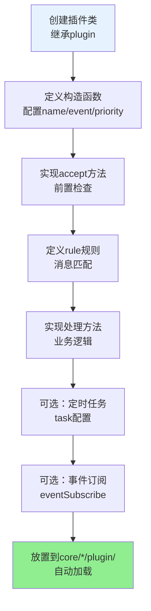
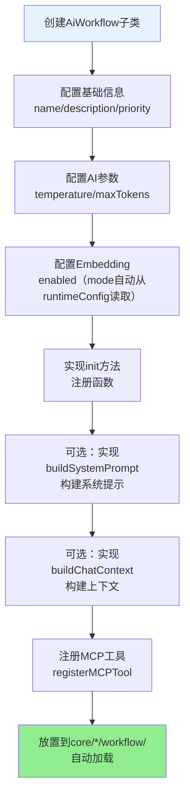
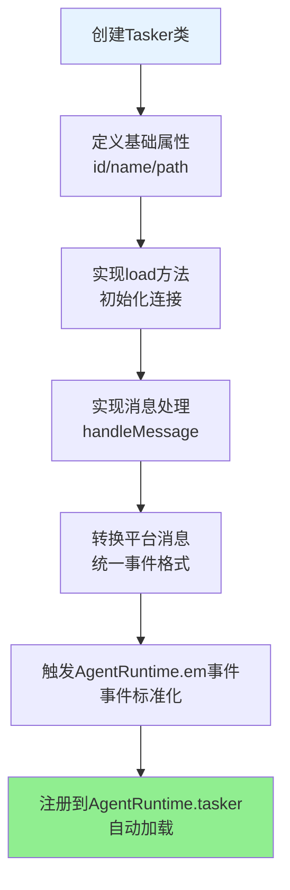
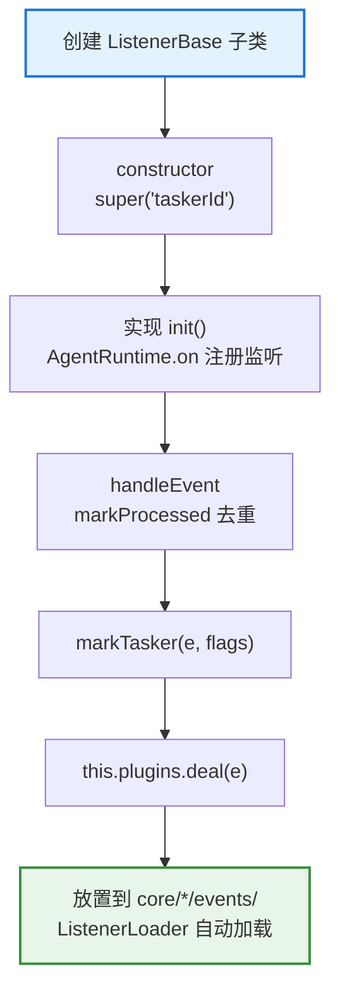
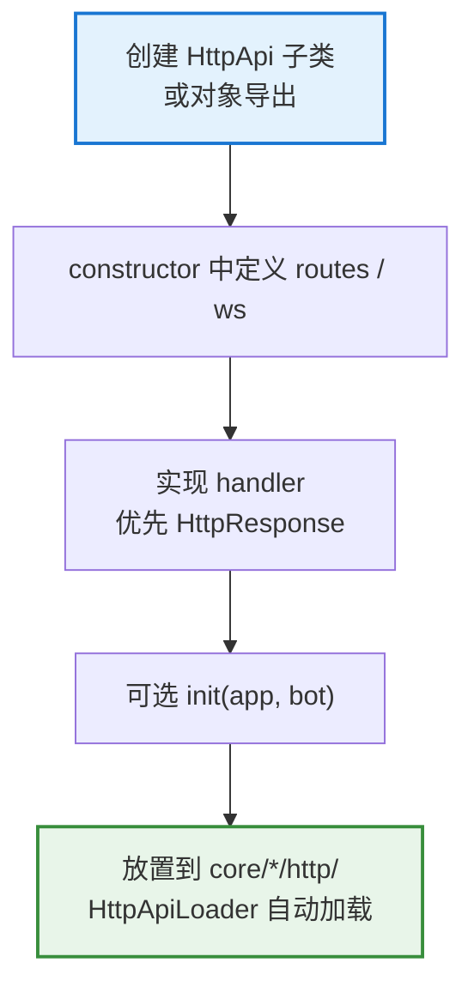
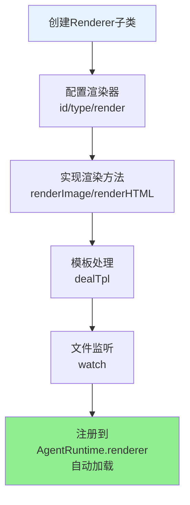
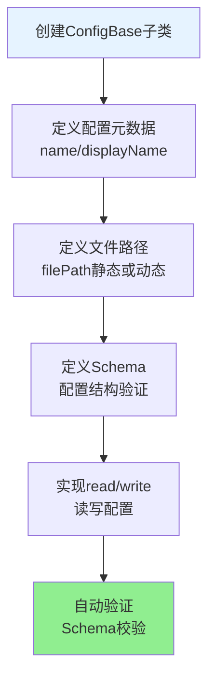
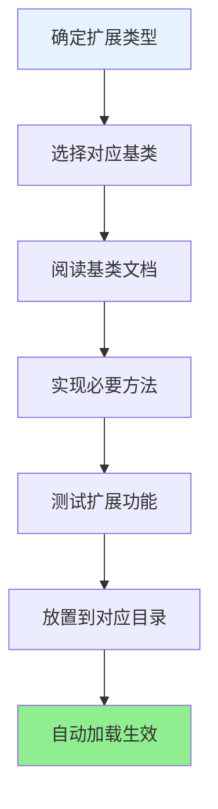

# XRK-AGT 框架可扩展性指南

> **定位**：在通用后端 Runtime 上扩展**智能体业务** — 业务只放在 `core/<名>/`，继承基类、放入约定目录即自动加载。  
> 架构边界：[底层架构设计.md](底层架构设计.md) · 基类契约：[base-classes.md](base-classes.md) · Loader 模式：[infrastructure-shared.md](infrastructure-shared.md)

## 📚 目录

- [可扩展性概述](#可扩展性概述)
- [核心扩展点](#核心扩展点)
- [插件系统扩展](#插件系统扩展)
- [工作流系统扩展](#工作流系统扩展)
- [Tasker扩展](#tasker扩展)
- [事件系统扩展](#事件系统扩展)
- [HTTP/API扩展](#httpapi扩展)
- [渲染器扩展](#渲染器扩展)
- [配置系统扩展](#配置系统扩展)
- [加载器扩展](#加载器扩展)
- [最佳实践](#最佳实践)

---

## 可扩展性概述

XRK-AGT 采用**分层 + 基类 + Loader**：`src/` 提供能力，`core/` 实现智能体与业务。

### 核心设计原则

1. **基础设施与业务分离**：业务在 `core/*/`；`src/` 不写业务 API/工作流
2. **基类抽象**：见 [base-classes.md](base-classes.md)（plugin / HttpApi / AiWorkflow / ConfigBase / ListenerBase）
3. **自动加载**：各 Loader 扫描 `core/*/<子目录>`；模式见 [infrastructure-shared.md](infrastructure-shared.md)
4. **标准化接口**：`/api/*` 默认鉴权、HttpResponse、EventNormalizer 等
5. **无特化逻辑**：底层不含单一产品硬编码

### 七大扩展点


| 扩展点 | 目录 | 基类 / 约定 | 专题 |
|--------|------|-------------|------|
| 插件 | `core/*/plugin/` · `data/ai-workspace/*/core/*/plugin/` | `plugin` | [plugin-base.md](plugin-base.md) |
| 工作流 | `core/*/workflow/` | `AiWorkflow` | [ai-workflow.md](ai-workflow.md) |
| Tasker | `core/*/tasker/` | 注册 `AgentRuntime.tasker` | [tasker-base-spec.md](tasker-base-spec.md) |
| 事件监听 | `core/*/events/` | `ListenerBase` | [事件系统标准化文档.md](事件系统标准化文档.md) |
| HTTP API | `core/*/http/` | `HttpApi` | [http-api.md](http-api.md) |
| 渲染器 | `src/renderers/` | `Renderer` | [renderer.md](renderer.md) |
| 配置 | `core/*/commonconfig/` | `ConfigBase` | [config-base.md](config-base.md) |

---

## Core 模块开发

> **Core开发时代**：现在所有业务都在 `core/` 目录下开发，每个 core 是一个独立的业务模块。core 根目录不再直接写业务代码，而是通过业务目录（如 `plugin/`、`tasker/` 等）来组织代码，方便业务分割和集成。

### Core 模块的核心概念

**什么是 Core 模块？**
- Core 模块是框架的业务单元，每个 core 代表一个独立的功能模块
- 所有业务代码都放在 `core/{coreName}/` 目录下，通过业务目录组织
- 框架会自动扫描所有 core 目录，统一加载所有资源
- 不同 core 的资源可以相互使用（如 core A 的 plugin 可以使用 core B 的 tasker）

**为什么使用 Core 模块？**
- ✅ **业务分割**：每个 core 专注于特定业务领域，代码组织清晰
- ✅ **独立依赖**：每个 core 可以有自己的 `package.json`，管理独立依赖
- ✅ **易于集成**：新功能可以作为新 core 开发，不影响现有代码
- ✅ **便于维护**：业务逻辑集中在 core 目录，易于定位和修改

### 创建 Core 模块的完整流程

#### 1. 创建 Core 目录结构

```
core/
└── my-core/              # 你的 core 模块名称
    ├── plugin/           # 业务插件目录（可选）
    │   └── my-plugin.js / my-plugin.ts
    ├── tasker/           # 任务层目录（可选）
    │   └── MyTasker.js / MyTasker.ts
    ├── events/           # 事件监听器目录（可选）
    │   └── my-listener.js / my-listener.ts
    ├── http/             # HTTP API目录（可选）
    │   └── my-api.js / my-api.ts
    ├── workflow/           # AI 工作流目录（可选）
    │   └── my-workflow.js / my-workflow.ts
    ├── commonconfig/     # 配置管理目录（可选，仅当需要配置文件时使用）
    │   └── my-config.js / my-config.ts
    ├── www/              # 静态资源目录（可选）
    │   └── my-app/       # ⚠️ 必须创建子目录，挂载到 /my-app/*
    │       ├── index.html
    │       └── app.js
    └── package.json      # 该 core 的依赖配置（可选）
```

> **TypeScript**：启动带 `--experimental-strip-types`（`start.bat` / `pnpm start`）。同名优先 `.ts`。见 [node-26-runtime.md](node-26-runtime.md)「TypeScript Core」。

#### 2. 业务目录说明

| 目录 | 用途 | 基类 | 是否必需 | 说明 |
|------|------|------|---------|------|
| `plugin/` | 业务插件 | `plugin-base.js` | 可选 | 处理消息事件、定时任务等 |
| `tasker/` | 任务层 | - | 可选 | 协议入站 Tasker，生成统一事件 |
| `events/` | 事件监听器 | `ListenerBase`（`listener/base.js`） | 可选 | 监听事件，去重后分发到插件 |
| `http/` | HTTP API | `http.js`（`HttpApi`） | 可选 | REST API 和 WebSocket |
| `workflow/` | AI 工作流 | `AiWorkflow.js` | 可选 | AI 工作流实现 |
| `commonconfig/` | 配置管理 | `ConfigBase` | 可选 | ⚠️ 仅当需要配置文件时使用 |
| `www/` | 静态资源 | - | 可选 | ⚠️ 必须创建子目录，避免路径冲突 |

#### 3. 关键注意事项

**www 目录规则**：
- ⚠️ **必须创建子目录**：不要在 `www/` 下直接放置文件
- 子目录自动挂载到 `/<目录名>/*`（如 `www/my-app/` 挂载到 `/my-app/*`）
- 避免与站点根静态（`core/system-Core/site/` → `/`）和系统保留路径（`/api`、`/core`、`/media` 等）冲突

**Core 下子客户端 / 子服务端项目存放约定（重要）**：
- 每个 `core/{coreName}/` 是一个业务单元容器，除了 `plugin/`、`http/`、`workflow/` 等框架约定目录外，可以在该 core 下维护与本 core 业务强相关的**子客户端 / 子服务端项目**，例如：
  - `core/my-core/www/xrk/`：通过 XRK-AGT 内置 Web 服务直接挂载的 Web 客户端（推荐用于需要由 AGT 直接提供静态资源的场景）
  - `core/my-core/miniprogram/`：与本 core 业务相关、但独立于 AGT Web 服务的微信小程序项目
  - `core/my-core/desktop-client/`、`core/my-core/electron-app/` 等：桌面端 / Electron 客户端代码
- **客户端目录**：
  - `www/`：由 XRK-AGT 进程直接托管的静态资源
  - 小程序、独立 Web、桌面客户端等可放在 Core 自约定子目录（如 `miniprogram/`、`desktop-client/`），避开框架保留目录（`plugin/`、`workflow/`、`events/`、`tasker/`、`commonconfig/` 等）
- 对于这类**独立子项目**，推荐做法：
  - 子项目自身可以是一个完整工程（自带 `package.json`、`project.config.json` 等），但默认不会被 XRK-AGT 当作 Node 包自动加载
  - 建议在子项目根目录添加独立 `.gitignore`，忽略：
    - 构建产物目录（如 `dist/`、`build/` 等）
    - 依赖目录（如 `node_modules/`、`miniprogram_npm/` 等）
    - IDE / 工具缓存（如 `.vscode/`、`.idea/` 等）
  - 这样既能保证 **Core 业务与子项目逻辑同仓管理**，又不会把不必要的构建/依赖文件提交到 XRK-AGT 主仓库

**commonconfig 使用规则**：
- 需要配置文件的 core 再创建 `commonconfig/`
- 配置类必须继承 `ConfigBase` 基类
- 配置文件存储在 `data/server_bots/{port}/` 目录

**导入路径规范（简化规则）**：
- 对于 **不自带 `package.json` 的 core 模块**（如 `system-Core`）：推荐使用根包定义的 `#` 别名，代码更简洁：
  - 可用别名：`#infrastructure/*`、`#utils/*`、`#factory/*`、`#config/*`、`#data/*`、`#core/*`
- 对于 **自带 `package.json` 的独立 core 包**：必须使用 **相对路径** 访问 `src/*` 等其他包内代码，避免出现 `ERR_PACKAGE_IMPORT_NOT_DEFINED`。示例：从 `core/my-core/http/my-api.js` 导入 `src/utils/runtime-util.js` 应使用 `../../../src/utils/runtime-util.js`。

#### 4. package.json 支持（可选）

每个 core 目录可以有自己的 `package.json` 来管理独立依赖：

```json
{
  "name": "my-core",
  "version": "1.0.5",
  "private": true,
  "dependencies": {
    "my-special-package": "^1.0.5"
  }
}
```

**特性**：
- ✅ 在项目根目录执行 `pnpm install` 时，会自动安装所有 core 的依赖
- ✅ 框架使用 pnpm workspace，core 目录已自动加入 workspace
- ✅ 每个 core 的依赖相互独立，互不影响
- ✅ 如果 core 没有 `package.json`，则不会处理依赖安装

#### 5. 跨 Core 资源共享

所有 core 的资源都可以被其他 core 使用：
- core A 的 plugin 可以使用 core B 的 tasker
- core C 的 http API 可以调用 core D 的 stream
- 框架会自动扫描所有 core 目录，统一加载所有资源

**示例**：
```javascript
// core/my-core/plugin/my-plugin.js
// 可以使用其他 core 的资源
import AiWorkflowLoader from '#infrastructure/ai-workflow/loader.js';

// 获取其他 core 的工作流
const chatStream = AiWorkflowLoader.getWorkflow('chat'); // 来自 system-Core
await chatStream.process(e, question);
```

### Core 开发最佳实践

#### 1. 业务分割原则

- **单一职责**：每个 core 专注于一个业务领域
- **独立开发**：core 之间尽量解耦，通过标准接口交互
- **可复用性**：公共功能放在 `system-Core`，业务功能放在自己的 core

#### 2. 目录组织建议

```
core/
├── system-Core/          # 系统核心功能（框架自带）
├── business-Core/        # 业务功能 core
├── integration-Core/     # 第三方集成 core
└── custom-Core/          # 自定义功能 core
```

#### 3. 开发新 Core 的完整流程

**步骤1：确定 Core 的业务范围**
- 明确这个 core 要解决什么问题（例如：用户管理、数据分析、第三方集成等）
- 确定需要哪些业务目录（`plugin/`、`http/`、`workflow/` 等）
- 考虑是否需要配置文件（决定是否创建 `commonconfig/`）

**步骤2：创建 Core 目录结构**
```bash
# 创建 core 目录
mkdir -p core/my-business-core

# 根据需求创建业务目录
mkdir -p core/my-business-core/plugin
mkdir -p core/my-business-core/http
# ... 其他业务目录
```

**步骤3：编写业务代码**
- 继承对应基类（`plugin`、`HttpApi`、`AiWorkflow` 等）
- 使用别名路径（`#` 前缀）导入框架模块
- 实现业务逻辑

**步骤4：配置依赖**（可选）
- 如果需要特殊依赖，创建 `package.json`
- 执行 `pnpm install` 安装依赖

**步骤5：测试验证**
- 重启服务，框架会自动加载新 core
- 验证功能是否正常

#### 4. Core 开发示例：创建一个完整的业务 Core

**场景**：创建一个"用户管理"业务 Core

**目录结构**：
```
core/user-management-core/
├── plugin/
│   ├── user-plugin.js      # 用户相关插件
│   └── admin-plugin.js     # 管理员插件
├── http/
│   └── user-api.js         # 用户管理API
├── workflow/
│   └── user-chat.js        # 用户聊天工作流
├── commonconfig/
│   └── user-config.js      # 用户配置（继承ConfigBase）
└── package.json            # 依赖配置
```

**代码示例**：
```javascript
// core/user-management-core/plugin/user-plugin.js
// plugin 基类由运行时全局注入；无需 import
export default class UserPlugin extends PluginBase {
  constructor() {
    super({
      name: '用户管理插件',
      event: 'message',
      priority: 5000,
      rule: [
        { reg: '^#用户信息$', fnc: 'getUserInfo' }
      ]
    });
  }

  async getUserInfo(e) {
    // 业务逻辑
    await this.reply('用户信息...');
  }
}
```

#### 5. AI 开发新 Core 时的关键理解点

**对于 AI 开发者，理解以下要点很重要**：

1. **Core 是业务单元**：按业务领域划分（如用户管理、数据分析、第三方集成）。

2. **业务目录组织**：core 根目录下通过业务目录（`plugin/`、`http/`、`workflow/` 等）组织代码。每个业务目录对应一种扩展类型，所有同类型的扩展都放在同一个目录下。

3. **基类继承模式**：所有业务代码都继承对应基类：
   - `plugin/` → 继承 `plugin` 基类
   - `http/` → 继承 `HttpApi` 基类
   - `workflow/` → 继承 `AiWorkflow` 基类
   - `events/` → 继承 `ListenerBase` 基类（`#infrastructure/listener/base.js`）
   - `commonconfig/` → 继承 `ConfigBase` 基类

4. **自动加载机制**：框架自动扫描所有 `core/*/业务目录/` 下的文件，无需手动注册。只要文件放在正确位置，就会被自动加载。

5. **跨 Core 资源共享**：不同 core 的资源可以相互使用。例如：
   - core A 的 plugin 可以调用 core B 的 stream
   - core C 的 http API 可以使用 core D 的 tasker
   - 通过加载器（如 `AiWorkflowLoader.getWorkflow()`）获取其他 core 的资源

6. **独立依赖管理**：每个 core 可以有自己的 `package.json`，管理独立依赖。执行 `pnpm install` 时自动安装所有 core 的依赖。

7. **配置管理规则**：只有需要配置文件的 core 才创建 `commonconfig/` 目录。配置类必须继承 `ConfigBase` 基类。

8. **静态资源规则**：Core 的 `www/` 必须创建子目录（如 `www/my-app/`），子目录自动挂载到 `/<目录名>/*`。站点根 `/` 静态放 `core/system-Core/site/`，不要与 Core `www/<app>/` 混放。

9. **导入路径规范（统一口径）**：根包通过 `package.json.imports` 提供 `#infrastructure/*`、`#utils/*` 等别名，供不带 `package.json` 的 core 直接使用；自带 `package.json` 的独立 core 则必须使用相对路径访问 `src/*` 等其他包内代码。详见本文档「导入路径规范」章节。

10. **开发流程**：确定业务范围 → 创建目录结构 → 继承基类编写代码 → 配置依赖（可选） → 测试验证

#### 导入路径规范

在 **不自带 `package.json` 的 core 模块** 中，推荐使用根包提供的 `#` 别名来导入框架模块，代码更清晰：

**✅ 推荐示例**：
```javascript
import ConfigBase from '#infrastructure/commonconfig/commonconfig.js';
import RuntimeUtil from '#utils/runtime-util.js';
import AiWorkflowLoader from '#infrastructure/ai-workflow/loader.js';
import { HttpResponse } from '#utils/http-utils.js';
```

在 **自带 `package.json` 的独立 core 包** 中，由于 Node 解析 `imports` 只在当前包生效，访问 `src/*` 等主包代码时必须使用相对路径（否则会报 `ERR_PACKAGE_IMPORT_NOT_DEFINED`）。示例：从 `core/my-core/http/my-api.js` 导入 `src/utils/runtime-util.js` 应使用 `../../../src/utils/runtime-util.js`。

---

## 核心扩展点

### 1. 插件系统扩展

**基类位置**: `src/infrastructure/plugins/plugin-base.js`

**扩展能力**:
- ✅ 消息处理（规则匹配、权限控制）
- ✅ 定时任务（cron表达式）
- ✅ 事件订阅（跨平台事件监听）
- ✅ 上下文管理（会话状态）
- ✅ 工作流集成（AiWorkflow调用）

**扩展流程图**:



**关键扩展点**:

1. **规则匹配系统**
   ```javascript
   // 支持多种规则格式
   rule: [
     { reg: '^#测试$', fnc: 'test' },           // 正则匹配
     { reg: /^#命令$/, fnc: 'command' },       // 正则对象
     { reg: '^#管理员', fnc: 'admin', permission: 'master' }  // 带权限
   ]
   // 插件执行顺序由 super({ priority }) 控制（数字越小越先）；rule 项本身无 priority 字段
   ```

  > 提醒：`rule[].fnc` 对应的方法会以事件对象 `e` 作为唯一参数调用（例如 `async test(e)`）。如果需要多轮上下文，请使用 `this.setContext/getContext`，不要把上下文当作函数入参。

2. **事件订阅系统**
   ```javascript
   // 跨平台事件监听
   eventSubscribe: [
     { eventType: 'message', handler: this.handleMessage },
     { eventType: 'onebot.*', handler: this.handleOneBot },
     { eventType: 'device.notice', handler: this.handleDevice }
   ]
   ```

3. **上下文管理**
   ```javascript
   // 设置上下文
   this.setContext('type', isGroup, time);
   
   // 获取上下文
   const ctx = this.getContext('type', isGroup);
   
   // 结束上下文
   this.finish('type', isGroup);
   ```

### 2. 工作流系统扩展

**基类位置**: `src/infrastructure/ai-workflow/ai-workflow.js`

**扩展能力**:
- ✅ 自定义工作流（继承AiWorkflow）
- ✅ 函数注册（Function Calling）
- ✅ Embedding提供商扩展
- ✅ 工作流合并（功能组合）
- ✅ 动态Prompt生成

**扩展流程图**:



**关键扩展点**:

1. **MCP工具注册系统**
   ```javascript
   // 统一使用registerMCPTool注册，所有工具都返回标准JSON格式
   this.registerMCPTool('my_function', {
     description: '功能描述',
     inputSchema: {
       type: 'object',
       properties: {
         param1: { type: 'string', description: '参数1' }
       },
       required: ['param1']
     },
     handler: async (args = {}, context = {}) => {
       // 执行逻辑
       return { success: true, data: { result: '...' } };
     },
     enabled: true
   });
   ```

2. **Embedding提供商扩展**
   ```javascript
   // 支持多种提供商
   embedding: {
     enabled: true,
     // embedding 配置自动从 runtimeConfig 读取，无需手动指定
   }
   ```

3. **工作流合并**
   ```javascript
   // 自动合并辅助工作流
   await stream.process(e, question, {
     mergeWorkflows: ['desktop', 'memory'],
     // 复杂任务建议使用工作流 + MCP 工具协作；必要时调用自定义子服务端扩展 API
     enableMemory: true
   });
   ```

### 3. Tasker扩展

**扩展位置**: `core/*/tasker/`

> **注意**：框架支持多 core 模块架构，每个 core 是一个独立的模块。所有 core 目录下的资源都会被自动扫描和加载，并且可以跨 core 使用。

**扩展能力**:
- ✅ Tasker（新平台入站）
- ✅ 事件生成（统一事件模型）
- ✅ 对象封装（平台特定对象）

**扩展流程图**:



**关键扩展点**:

1. **事件生成**
   ```javascript
   // 通过AgentRuntime.em触发标准化事件
   AgentRuntime.em('tasker.message', {
     event_id: `tasker_${Date.now()}`,
     tasker: 'mytasker',
     user_id: data.user_id,
     message: [{ type: 'text', text: data.text }]
   });
   ```

2. **对象封装**
   ```javascript
   // 通过增强插件挂载平台特定对象
   // 在enhancer插件中
   e.friend = AgentRuntime[self_id].pickFriend(user_id);
   e.group = AgentRuntime[self_id].pickGroup(group_id);
   ```

### 4. 事件监听器扩展

**基类位置**: `src/infrastructure/listener/base.js`（`ListenerBase`）

**扩展能力**:
- ✅ 事件监听（跨平台事件）
- ✅ 事件预处理（去重、标记）
- ✅ 事件分发（调用PluginLoader）

**扩展流程图**:



### 5. HTTP/API扩展

**基类位置**: `src/infrastructure/http/http.js`（`HttpApi` 基类）

**扩展能力**:
- ✅ REST API（路由注册）
- ✅ WebSocket（实时通信）
- ✅ 中间件（认证、日志等）

**扩展流程图**:



### 6. 渲染器扩展

**基类位置**: `src/infrastructure/renderer/Renderer.js`

**扩展能力**:
- ✅ 模板渲染（HTML模板）
- ✅ 图片生成（Puppeteer/Playwright）
- ✅ 文件监听（自动重载）

**扩展流程图**:



### 7. 配置系统扩展

**基类位置**: `src/infrastructure/commonconfig/commonconfig.js`（`ConfigBase` 基类）

**扩展目录**: `core/*/commonconfig/`（存放继承 `ConfigBase` 的配置类）

**重要说明**：
- 需要配置的 core 再创建 `commonconfig/` 目录
- `commonconfig` 存放配置管理类；基类为 `ConfigBase`（`src/infrastructure/commonconfig/commonconfig.js`）
- 配置类继承 `ConfigBase` 并实现配置元数据

**扩展能力**:
- ✅ 配置文件管理（YAML/JSON）
- ✅ 动态路径（函数式路径）
- ✅ 配置验证（Schema验证）
- ✅ 配置备份（自动备份）
- ✅ 多文件配置（一个配置包含多个子文件）

**扩展流程图**:



---

## 插件系统扩展

**详细文档**：参考 [`docs/plugin-base.md`](plugin-base.md) 和 [`docs/plugins-loader.md`](plugins-loader.md)

### 快速示例

#### 1. 规则匹配系统

支持多种规则格式，灵活匹配消息：

```javascript
rule: [
  // 字符串正则
  { reg: '^#测试$', fnc: 'test' },
  
  // 正则对象
  { reg: /^#命令\d+$/, fnc: 'command' },
  
  // 带权限检查
  { reg: '^#管理员', fnc: 'admin', permission: 'master' }
]
// 同插件内多条 rule 按数组顺序匹配；跨插件顺序见 super({ priority })（越小越先）
```

#### 2. 上下文管理

支持会话状态管理：

```javascript
// 设置上下文（30秒有效）
this.setContext('waiting_input', e.isGroup, 30);

// 获取上下文
const ctx = this.getContext('waiting_input', e.isGroup);
if (ctx) {
  // 处理上下文相关逻辑
  this.finish('waiting_input', e.isGroup);
}
```

#### 3. 工作流集成

插件可以无缝调用工作流：

```javascript
// 获取工作流
const stream = AiWorkflowLoader.getWorkflow('chat');

// 调用工作流
await stream.process(e, question, {
  mergeWorkflows: ['desktop'],  // 合并主工作流
  enableMemory: true,         // 整合工具工作流
  enableDatabase: true,       // 整合工具工作流
  enableTools: true          // 整合工具工作流
});
```

---

## 工作流系统扩展

### 完整扩展示例

```javascript
import AiWorkflow from '#infrastructure/ai-workflow/ai-workflow.js';
import RuntimeUtil from '#utils/runtime-util.js';

export default class MyWorkflow extends AiWorkflow {
  constructor() {
    super({
      name: 'my-workflow',
      description: '我的自定义工作流',
      version: '1.0.5',
      author: 'YourName',
      priority: 100,
      
      // AI配置
      config: {
        enabled: true,
        temperature: 0.7,
        maxTokens: 4000
      },
      
      // Embedding配置
      embedding: {
        enabled: true
        // embedding 配置自动从 runtimeConfig 读取，无需手动指定
        // embedding 段由 AiWorkflowLoader.applyEmbeddingConfig 自动合并，无需在 init() 中处理
      }
    });
  }

  async init() {
    await super.init();
    // embedding 配置由 AiWorkflowLoader 加载时合并，无需手动初始化向量服务
    this.registerAllFunctions();
    RuntimeUtil.makeLog('info', `[${this.name}] 工作流已初始化`, 'MyWorkflow');
  }

  registerAllFunctions() {
    // 注册MCP工具（统一工具注册方式）
    this.registerMCPTool('my_function', {
      description: '我的功能',
      inputSchema: {
        type: 'object',
        properties: {
          param: {
            type: 'string',
            description: '功能参数'
          }
        },
        required: ['param']
      },
      handler: async (args = {}, context = {}) => {
        const { param } = args;
        // 处理逻辑
        const result = await this.doMyFunction(param);
        return { success: true, data: { result } };
      },
      enabled: true
    });
  }

  // 可选实现：构建系统提示词（如果未实现，基类返回空字符串）
  buildSystemPrompt(context) {
    return `【人设】
你是一个智能助手。

【工具说明】
所有功能都通过MCP工具调用协议提供，包括：my_function等。

【执行规则】
1. 规则1
2. 规则2`;
  }

  // 可选实现：构建聊天上下文（如果未实现，基类返回空数组）
  async buildChatContext(e, question) {
    const messages = [];
    
    // 添加系统提示词
    const systemPrompt = this.buildSystemPrompt({ e, question });
    if (systemPrompt) {
      messages.push({
        role: 'system',
        content: systemPrompt
      });
    }
    
    // 添加用户消息
    const questionText = typeof question === 'string' 
      ? question 
      : (question?.content || question?.text || '');
    
    messages.push({
      role: 'user',
      content: questionText
    });
    
    return messages;
  }

  getDynamicInfo() {
    // 动态获取信息
    return '实时信息';
  }
}
```

### 扩展点详解

#### 1. Embedding配置

Embedding 配置自动从 `runtimeConfig.aiWorkflow.embedding` 读取，工作流只需设置 `enabled`：

```javascript
// ai-workflow.yaml → embedding（由 AiWorkflowLoader.applyEmbeddingConfig 合并到各工作流）
embedding: {
  enabled: true,   // 是否启用 RAG / 记忆增强
  maxContexts: 5   // retrieveKnowledgeContexts 单次上限
}
```

#### 2. 工作流合并机制

支持工作流功能合并，通过 `process` 方法的 `options` 参数控制：

```javascript
// 主工作流
const mainStream = AiWorkflowLoader.getWorkflow('chat');

// 合并主工作流 + 整合工具工作流（推荐方式）
await mainStream.process(e, question, {
  mergeWorkflows: ['memory', 'database', 'tools', 'desktop']
});

// 推荐唯一组合路径：mergeWorkflows → AiWorkflowLoader.mergeWorkflows（不 mutate 主单例）
// enableMemory/Database/Tools 仅无 mergeWorkflows 时的兼容别名
// web/browser 等声明 frameworkToolSurface 的流自动进 chat 工具白名单
```

**工作流整合机制**：
- `mergeWorkflows`：副流名称列表（`memory`、`database`、`tools`、`desktop` 等）
- `enableMemory` / `enableDatabase` / `enableTools`：兼容别名 → 映射为副流后仍走 `mergeWorkflows`
- 合成实例不二次注册 MCP（避免双前缀）；LLM 白名单按成分流名匹配

---

## Tasker扩展

**详细文档**：参考 [`docs/tasker-base-spec.md`](tasker-base-spec.md)、[`docs/tasker-loader.md`](tasker-loader.md)

### 快速示例

#### 1. 事件生成

Tasker需要将平台消息转换为统一事件格式：

```javascript
AgentRuntime.em('tasker.message', {
  // 基础字段（必填）
  event_id: string,      // 事件ID
  tasker: string,        // Tasker类型
  tasker_id: string,     // Tasker ID
  tasker_name: string,   // Tasker名称
  user_id: string,       // 用户ID
  message: Array,        // 消息数组
  raw_message: string,   // 原始消息
  time: number,          // 时间戳
  bot: BotInstance,      // AgentRuntime实例
  reply: Function,       // 回复方法
  
  // 可选字段
  sender: Object,        // 发送者信息
  group_id: string,     // 群组ID（群消息时）
  // ... 其他平台特定字段
});
```

#### 2. 增强插件

平台特定对象通过增强插件挂载：

```javascript
// core/my-core/plugin/MyTaskerEnhancer.js
export default class MyTaskerEnhancer extends PluginBase {
  constructor() {
    super({
      name: 'MyTasker增强插件',
      event: 'mytasker.message',
      priority: 1
    });
  }

  async accept(e) {
    // 挂载平台特定对象
    e.friend = this.getFriend(e.user_id);
    e.group = this.getGroup(e.group_id);
    e.isGroup = !!e.group_id;
    e.isPrivate = !e.isGroup;
    
    return true;
  }
}
```

---

## 事件系统扩展

完整模板与流程图见 **[事件系统标准化文档](事件系统标准化文档.md)**。要点：

- 基类：`ListenerBase`（`src/infrastructure/listener/base.js`）。
- `constructor(taskerId)` 只接收 tasker 短名；在 `init()` 里用 `AgentRuntime.on` / `this.bot.on` 注册事件。
- 去重用 `markProcessed(e)`；标记 Tasker 用 `markTasker(e, { ...flags })`（第二参为对象）。
- 分发用 `this.plugins.deal(e)`（基类已注入 `PluginLoader`）。

```javascript
import ListenerBase from '#infrastructure/listener/base.js';

export default class MyTaskerEvent extends ListenerBase {
  constructor() {
    super('mytasker');
  }

  async init() {
    const bot = this.bot || AgentRuntime;
    bot.on('mytasker.message', (e) => this.handleEvent(e));
  }

  async handleEvent(e) {
    if (!this.markProcessed(e)) return;
    this.markTasker(e, { isMyTasker: true });
    await this.plugins.deal(e);
  }
}
```

---

## HTTP/API扩展

**详细文档**：参考 [`docs/http-api.md`](http-api.md)、[`docs/api-loader.md`](api-loader.md)

### 快速示例

---

## 渲染器扩展

### 完整扩展示例

```javascript
import Renderer from '#infrastructure/renderer/Renderer.js';

export default class MyRenderer extends Renderer {
  constructor() {
    super({
      id: 'my-renderer',
      type: 'image',
      render: 'renderImage'
    });
  }

  async renderImage(data) {
    // 处理模板
    const htmlPath = await this.dealTpl('my-template', {
      tplFile: 'resources/html/my-template.html',
      data: data
    });

    // 使用Puppeteer/Playwright渲染
    const imagePath = await this.renderWithPuppeteer(htmlPath);
    
    return imagePath;
  }
}
```

---

## 配置系统扩展

**详细文档**：参考 [`docs/config-base.md`](config-base.md)

### 子服业务插件

**配置管理全在主服**；子服只读 `data/<group>/config.yaml`。schema 在 `apis/<group>/core/commonconfig/*.js`；子服连接在 **AiWorkflow → 子服务端**（`runtimeConfig.subserver`）。

详见 [subserver-commonconfig.md](subserver-commonconfig.md)、[subserver-plugin-development.md](subserver-plugin-development.md)。

### 快速示例

### 多文件配置（高级特性）

当配置需要按类型拆分为多个文件时（如渲染器配置包含 puppeteer 和 playwright），可以使用 `multiFile` 特性。详细说明请参考 [`docs/config-base.md`](config-base.md)。

---

## Node.js 26 扩展开发约定

> **唯一清单**：[node-26-runtime.md](node-26-runtime.md) · skill **`xrk-node-runtime`** · 规则 **`xrk-dev-requirements.mdc`**

扩展 Core 时使用项目已统一的 Node 26 API；**不要**在 Core 中修改 `src/infrastructure/`。

---

## 最佳实践

> 本节提供扩展开发的最佳实践和代码质量规范，帮助开发者编写高质量、易维护的扩展代码。

### 1. 核心设计原则

#### 基础设施与业务分离

**原则**：基础设施层提供通用能力，业务层专注具体实现。

**实践**：
- ✅ 所有业务代码放在 `core/*/` 目录下
- ✅ 基础设施代码放在 `src/infrastructure/` 目录下
- ❌ 不要在 `src/` 下写业务逻辑

#### 基类抽象

**原则**：所有功能都基于基类，通过继承快速扩展。

**实践**：
- ✅ 继承对应的基类（`plugin`、`AiWorkflow`、`HttpApi` 等）
- ✅ 实现必要的方法
- ❌ 不要直接修改基类代码

#### 自动加载机制

**原则**：通过加载器自动发现和加载扩展。

**实践**：
- ✅ 放置到约定目录即可自动加载
- ✅ 遵循命名规范
- ❌ 不要手动注册扩展

#### 标准化接口

**原则**：统一的接口规范，易于集成和维护。

**实践**：
- ✅ 遵循基类定义的接口
- ✅ 使用统一的命名规范
- ❌ 不要创建自定义接口

#### 无特化逻辑

**原则**：底层代码不包含任何针对特定业务场景的硬编码。

**实践**：
- ✅ 使用配置和参数化
- ✅ 通过扩展点实现特化逻辑
- ❌ 不要在基础设施层写业务逻辑

### 2. 扩展开发流程



### 3. 代码质量规范

> **权威文档**：[coding-style.md](coding-style.md)（速查表、I/O/异步/HTTP/状态）。本节仅保留扩展指南特有项。

- 命名：插件/工作流 **PascalCase**；HTTP/配置 **kebab-case**
- 依赖：根仓库用 `#` 别名；子 Core 用相对路径到 `src/`（见 coding-style §2）
- 性能：Loader 用 `forEachBatch`；热路径避免 `existsSync`；详见 coding-style §4–§5

### 4. 扩展命名规范

> **注意**：框架支持多 core 模块架构。每个 core 是一个独立的模块，可以包含所有类型的扩展。

- **插件**: `core/{coreName}/plugin/my-plugin.js` (如 `core/my-core/plugin/my-plugin.js`)
- **工作流**: `core/{coreName}/workflow/my-workflow.js`
- **Tasker**: `core/{coreName}/tasker/MyTasker.js`
- **事件监听器**: `core/{coreName}/events/my-listener.js`
- **HTTP API**: `core/{coreName}/http/my-api.js`
- **配置**: `core/{coreName}/commonconfig/my-config.js`（继承 `ConfigBase` 基类，仅当需要配置文件时使用）
- **静态资源**: `core/{coreName}/www/` 
  - ⚠️ **必须创建子目录**：不要在 `www/` 下直接放置文件，必须创建子目录（如 `www/xrk/`）
  - 子目录自动挂载到 `/<目录名>/*`（如 `www/xrk/` 挂载到 `/xrk/*`），避免与站点根 `site/`（`/`）冲突
- **渲染器**: `src/renderers/my-renderer.js` (渲染器仍在 `src/renderers/`)

### 5. 扩展优先级

- **插件**: `priority` 越小越先执行
- **工作流**: `priority` 越大优先级越高
- **规则匹配**: `priority` 越小越先匹配

### 6. 扩展测试

```javascript
// 测试插件
const plugin = new MyPlugin();
await plugin.init();
const result = await plugin.test(e);

// 测试工作流
const stream = AiWorkflowLoader.getWorkflow('my-workflow');
const response = await stream.process(e, '测试消息');

// 测试 API（init 会注册路由与 WebSocket）
const api = new MyAPI();
await api.init(app, bot);
```

### 7. 扩展调试

- 使用 `AgentRuntime.makeLog()` 记录日志
- 查看加载器统计信息
- 检查扩展是否正确注册
- 验证扩展方法是否被调用

---

## 扩展示例

### 示例1：完整插件扩展

```javascript
import AiWorkflowLoader from '#infrastructure/ai-workflow/loader.js';

// plugin 基类由运行时全局注入；无需 import
export default class CompletePlugin extends PluginBase {
  constructor() {
    super({
      name: '完整插件示例',
      event: 'message',
      priority: 5000,
      rule: [
        { reg: '^#测试$', fnc: 'test' },
        { reg: '^#工作流', fnc: 'workflow' }
      ],
      task: [
        {
          name: '定时任务',
          cron: '0 0 * * *',
          fnc: 'scheduledTask'
        }
      ],
      eventSubscribe: [
        { eventType: 'onebot.notice', handler: this.handleNotice }
      ]
    });
  }

  async accept(e) {
    // 权限检查
    if (e.user_id !== 'admin') {
      return false;
    }
    return true;
  }

  async test(e) {
    await this.reply('测试成功');
  }

  async workflow(e) {
    const stream = AiWorkflowLoader.getWorkflow('chat');
    await stream.process(e, e.msg, {
      // 复杂任务建议使用工作流 + MCP 工具协作；必要时调用自定义子服务端扩展 API
    });
  }

  async scheduledTask() {
    AgentRuntime.makeLog('info', '定时任务执行', 'CompletePlugin');
  }

  async handleNotice(e) {
    // 处理通知事件
  }
}
```

### 示例2：完整工作流扩展

```javascript
import AiWorkflow from '#infrastructure/ai-workflow/ai-workflow.js';

export default class CompleteWorkflow extends AiWorkflow {
  constructor() {
    super({
      name: 'complete-workflow',
      description: '完整工作流示例',
      version: '1.0.5',
      priority: 100,
      config: {
        temperature: 0.7,
        maxTokens: 4000
      },
      embedding: {
        enabled: true
        // enabled / maxContexts 等自动从 runtimeConfig.aiWorkflow.embedding 合并
        // embedding 段由 AiWorkflowLoader.applyEmbeddingConfig 自动合并，无需在 init() 中处理
      }
    });
  }

  async init() {
    await super.init();
    // embedding 配置由 AiWorkflowLoader 加载时合并，无需手动初始化向量服务
    this.registerAllFunctions();
  }

  registerAllFunctions() {
    // 注册多个函数
    this.registerMCPTool('function1', { 
      description: '功能1',
      inputSchema: { type: 'object', properties: {}, required: [] },
      handler: async (args, context) => ({ success: true, data: {} })
    });
    this.registerMCPTool('function2', { 
      description: '功能2',
      inputSchema: { type: 'object', properties: {}, required: [] },
      handler: async (args, context) => ({ success: true, data: {} })
    });
  }

  buildSystemPrompt(context) {
    return `【人设】
你是一个智能助手。

【可用功能】
`;
  }

  async buildChatContext(e, question) {
    // 构建上下文
    return messages;
  }
}
```

---

## 扩展能力总结

### 扩展能力矩阵

| 扩展类型 | 基类位置 | 扩展目录 | 自动加载 | 优先级支持 | 热重载 |
|---------|---------|---------|---------|-----------|--------|
| 插件 | `plugin-base.js` | `core/*/plugin/` | ✅ | ✅ | ✅ |
| 工作流 | `ai-workflow.js` | `core/*/workflow/` | ✅ | ✅ | ✅ |
| Tasker | - | `core/*/tasker/` | ✅ | - | ✅ |
| 事件监听器 | `ListenerBase`（`listener/base.js`） | `core/*/events/` | ✅ | ✅ | ✅ |
| HTTP API | `http.js`（`HttpApi`） | `core/*/http/` | ✅ | ✅ | ✅ |
| 配置 | `ConfigBase`（`commonconfig.js`） | `core/*/commonconfig/` | ✅ | - | ✅ |
| 静态资源 | - | `core/*/www/` | ✅ | - | - |
| 渲染器 | `Renderer.js` | `src/renderers/` | ✅ | - | ✅ |

> **注意**：`core/*/` 表示所有 core 目录。例如，`core/system-Core/plugin/` 和 `core/my-core/plugin/` 中的插件都会被自动加载。

### 扩展优势

1. **零配置扩展**：放置到对应目录即可自动加载
2. **标准化接口**：统一的基类和接口规范
3. **灵活组合**：支持功能合并和组合
4. **热重载支持**：修改代码后自动重载
5. **完整生命周期**：提供init、cleanup等生命周期钩子

---

## 相关文档

- **[底层架构设计](底层架构设计.md)** · **[startup.md](startup.md)** · **[base-classes.md](base-classes.md)**
- **[Node 26 运行时约定](node-26-runtime.md)**
- **[AiWorkflow 文档](ai-workflow.md)** · **[插件基类文档](plugin-base.md)**
- **[PROJECT_OVERVIEW.md](../PROJECT_OVERVIEW.md)** — 目录树

---

## 总结

七大扩展点均通过 **基类 + Loader** 自动发现；详细 API 见各专题文档，业务只写在 `core/*/`，勿改 `src/infrastructure/`。

---

*最后更新：2026-06-14*
